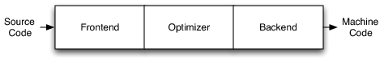
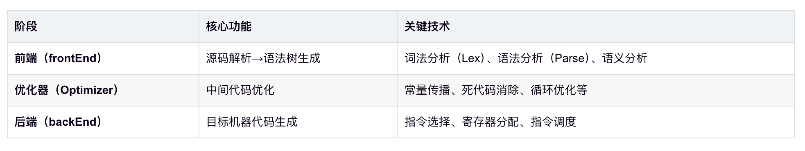
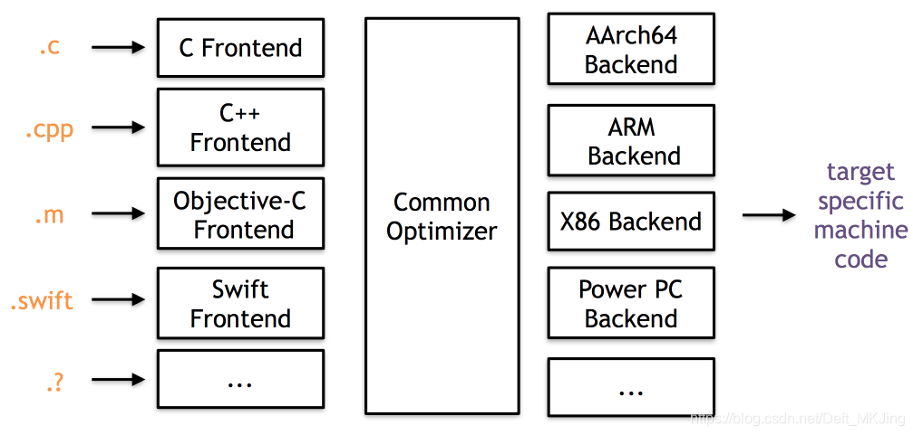
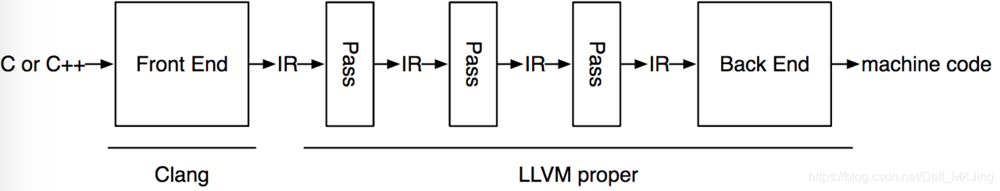
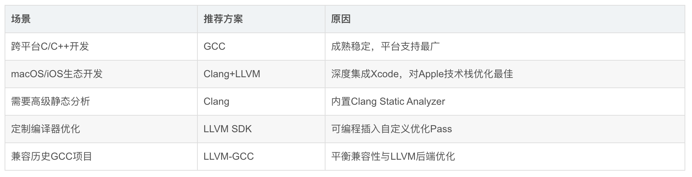

# LLVM
- LLVM 命名最早源自于底层虚拟机（Low Level Virtual Machine）的缩写, 现在只是项目名
- Clang 是 LLVM 的子项目，是ios的编译器

## 三段式模型
- gcc 和 llvm 都使用了这个模型
- gcc 缺陷
    - 是一个整体的可执行文件，没有把前后端分的太开
    - 新增一个语言或者平台，就比较麻烦
- LLVM 解决了上述问题
    - LLVM 不仅仅是编译器，也是一个sdk
    - 所有前端使用同一个优化器，叫做 中间代码/LLVM IR（LLVM Intermediate Representation）
    - 增加新语言，就添加一个前端；增加新平台，就添加一个后端

## Clang 对比 Gcc
- 编译速度快
- 占用内存小
- 模块化设计
- 诊断可读性强
- 设计清晰简单

## 工具链选型建议

# 毕昇编译器
- DevEco Studio 5.1.1 release及之后的版本，默认使用毕昇编译器
- 毕昇编译器是**基于LLVM开源软件**开发的一款用于C/C++等语言的native编译器
- 提供更强大的优化能力，使编译链接出来的二进制的运行时长更短、指令数更少

## 能力范围
- 编译能力：将C/C++源码文件编译成汇编文件
- 汇编能力：将汇编文件汇编成可重定向文件，可重定向文件是ELF格式的二进制文件，但不能直接放在设备上运行
- 链接能力：将一个或多个可重定向文件一起链接成一个可执行的二进制文件。