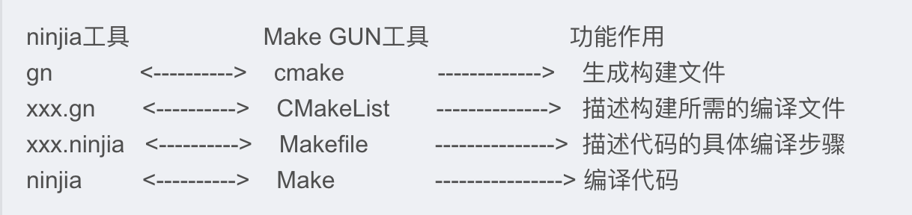
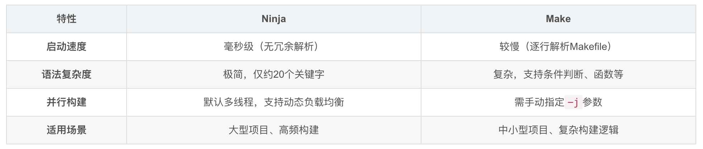
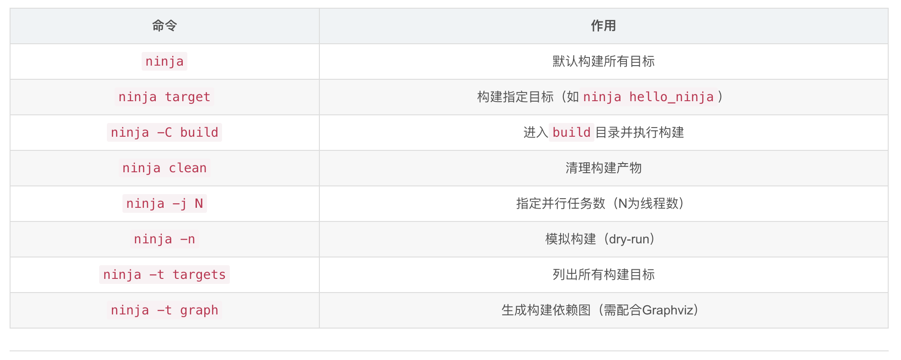

# ninja
- 目的：替代传统工具make
- 一个**专注于速度和最小化**构建开销的构建系统，由Google开发
- 适用于**大型项目**和高频构建场景，支持高效并行处理
- gn，generate ninja，类似于cmake
- google Chrome 编译，鸿蒙系统组件的编译
- 通常通过CMake等工具生成其构建文件生成器友好‌：通常由CMake、GN等工具生成build.ninja文件，而非手动编写
    - 在CMakeLists.txt中配置项目后，生成Ninja文件：cmake -G "Ninja" .

# gn 和 ninja


# Ninja 和 make 效率比较


# ninja 核心命令


# ninja 使用
```
# 安装ninja
$ brew install ninja
$ ninja --version

# 使用 cmake 生成 build.ninja
$ cmake -GNinja # cmake -GNinja -DCMAKE_MAKE_PROGRAM=ninja

# 使用 ninja 编译
$ ninja
```