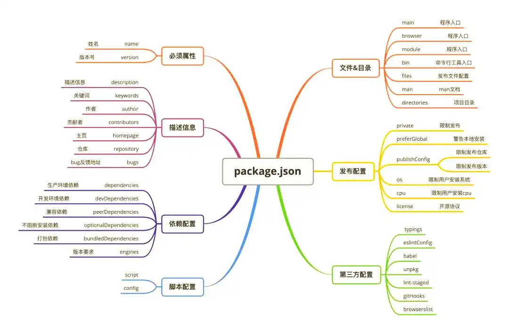
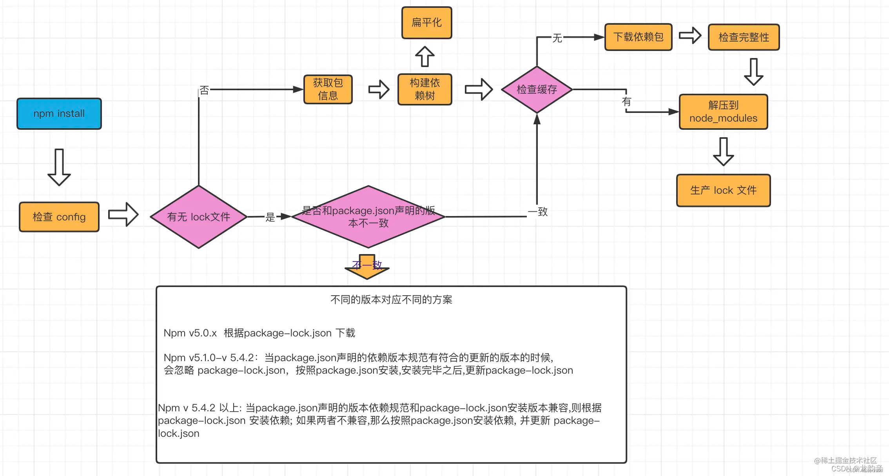

# Nodejs
- Node.js是运行在服务端的JavaScript。
- Node.js是一个基于Chrome JavaScript运行时建立的一个平台。
- Node.js是一个事件驱动I/O服务端JavaScript环境，基于Google的V8引擎

# nodejs 环境
- node，nodejs环境
- npm，包管理工具，node安装后自带模块
- npx
    - 调用项目内部的包
    - 原理：运行时，把当前目录node_modules/.bin路径添加到$PATH变量
    - npm 5.25.2开始，node安装后自带模块

## 判断环境
```
# 判断 nodejs 版本
node --version

# 判断 npm 版本
# NPM是随同NodeJS一起安装的包管理工具
npm -v
```

## 设置开发环境
- 使用vscode
- 安装插件
    - Code Runner，能运行很多语言
    - JavaScript (ES6) code snippets，语法提示
- 配置调试环境
    - 点击左侧 run and debug
    - 在第一个选项下， create a launch.json file
    - 改为 "program": "${file}"
    - 此时可以运行js文件，而不用改文件名字

# Node.js REPL(交互式解释器)
- Node 自带了交互式解释器
- REPL 命令
    - ctrl + c - 退出当前终端。
    - ctrl + c 按下两次 - 退出 Node REPL。
    - ctrl + d - 退出 Node REPL.
    - 向上/向下 键 - 查看输入的历史命令
    - tab 键 - 列出当前命令
    - .help - 列出使用命令
    - .break - 退出多行表达式
    - .clear - 退出多行表达式
    - .save filename - 保存当前的 Node REPL 会话到指定文件
    - .load filename - 载入当前 Node REPL 会话的文件内容。

```
$ node
> 1 +4
5

# 变量声明需要使用 var 关键字，如果没有使用 var 关键字变量会直接打印出来
> x = 10
10
> var y = 10
undefined
> x + y
20
```

# 创建工程
## npm init
- 交互式命令
- 提示输入项目的各种信息，比如版本，描述等

## npm init -y #npm init -yes
- 直接生成 package.json 文件
- 包含了项目的基本信息

## package.json 
- 包含了项目的元数据和配置信息
- 负责配置**项目的启动和打包**命令，还是声明**依赖包**的关键文件
- 使用 npm install 安装package.json中的依赖


