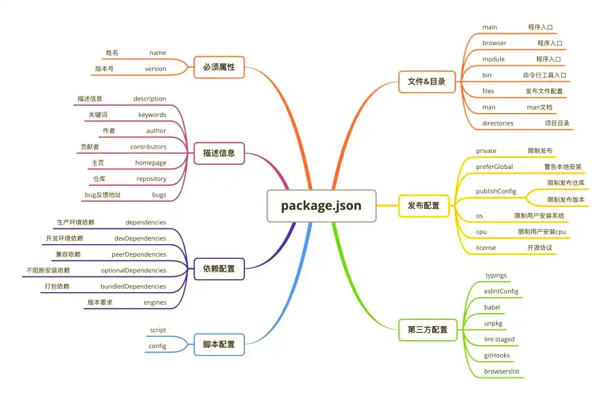
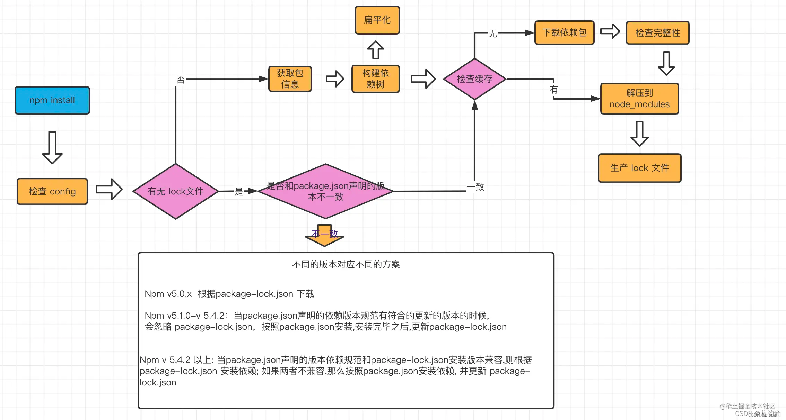

# Hello World
```
// 第一个Node.js程序
console.log("Hello World");

// 程序执行后，正常的话，就会在终端输出Hello World
node helloworld.js
```

# 创建工程
## npm init
- 交互式命令
- 提示输入项目的各种信息，比如版本，描述等

## `npm init -y # npm init -yes`
- 直接生成 package.json 文件
- 包含了项目的基本信息

## package.json 
- package.json 位于项目根目录下
- 包含了项目的元数据和配置信息
- 负责配置**项目的启动和打包**命令，还是声明**依赖包**的关键文件
- **使用 npm install 安装package.json中的依赖**

### package.json 属性说明
- name - 包名。
- version - 包的版本号。
- description - 包的描述。
- dependencies
    - 依赖包列表
    - 如果依赖包没有安装，npm 会自动将依赖包安装在 node_module 目录下
    - **使用 npm install 安装package.json中的依赖**
- main 
    - 指定了程序的主入口文件，require('moduleName') 就会加载这个文件
    - 默认值是模块根目录下面的 index.js。
- repository - 包代码存放的地方的类型，可以是 git 或 svn，git 可在 Github 上。    
- keywords - 关键字



### 使用 npm install 安装package.json中的依赖
