# 文档
- 开发文档：[应用开发导读-基础入门 - 华为HarmonyOS开发者 (huawei.com)](https://developer.huawei.com/consumer/cn/doc/harmonyos-guides/application-dev-guide)
- 在线培训：[华为开发者学堂首页-面向开发者学习、认证和职业发展的人才生态平台-华为开发者学堂 (huawei.com)](https://developer.huawei.com/consumer/cn/training/)
- [HarmonyOS: HarmonyOS (gitee.com)](https://gitee.com/harmonyos)
# HarmonyOS 和 OpenHarmony
- **OpenHarmony**
    - **开源基础底座**：由开放原子开源基金会（OpenAtom Foundation）运营，华为捐赠代码并持续贡献，但不独占所有权。
    - **类似Android的AOSP**：提供操作系统的基础框架（内核、驱动、基础服务），允许开发者自由定制，适用于各类IoT设备（如工业传感器、智能家居）
    - **适用领域**：工业设备、嵌入式系统、低成本IoT设备（如智能电表、传感器）。
    - **优势**：高定制化、低冗余代码，厂商可自主控制底层实现
        
- **HarmonyOS**
    - **商用操作系统**：华为**基于OpenHarmony开发的闭源商用版本**，面向消费者终端（手机、平板、手表等）。
    - **早期兼容安卓生态**
	    - 通过集成AOSP（Android开源项目）支持运行安卓APK应用
	    - 2024年10月发布的HarmonyOS 5.0彻底移除AOSP，仅支持原生鸿蒙应用（.hap）
	- **适用领域**：消费级设备（手机/平板/车机），强调跨设备无缝协同

| 特性    | OpenHarmony                         | HarmonyOS                            |
| ----- | ----------------------------------- | ------------------------------------ |
| 内核    | 纯鸿蒙微内核                              | 早期：鸿蒙内核 + Linux内核/AOSP；              |
| 应用兼容性 | ❌ 不支持安卓APK，仅运行原生OpenHarmony应用（.hap） | ✅ 过渡期支持安卓APK HarmonyOS NEXT：纯鸿蒙内核 |
| 分布式能力 | 基础框架，需厂商自行扩展                        | 成熟的分布式软总线、多设备协同（如多屏互动）               |
| 开发语言  | JS/ArkTS（不支持Java）                   | 早期支持Java； 新版本仅支持ArkTS/仓颉语言        |

# 常见概念
- 物联网（英文：Internet of Things，缩写：IoT）
- 2in1
    - 兼具平板电脑的便携性和笔记本电脑的生产力功能
    - 通过硬件设计（如可拆卸键盘、触控屏）和系统适配（如HarmonyOS的多模交互支持），实现了平板与笔记本功能的无缝切换
    - 华为MatePad Pro 13.2英寸（2025款）是当前代表性的2in1设备
- Ability
    - 应用的基本组成部分，是应用所具备能力的抽象
    - 个应用可以包含一个或多个Ability    
- SystemCapability：简称 SysCap，即系统能力
    - 操作系统中每一个相对独立的特性，如蓝牙，WLAN，NFC，摄像头等

# 应用
- 传统app
- 轻量级：免安装，随处可及，服务直达，自由流转
    - **元服务**：类似于微信小程序，只是基于 HarmonyOS 平台
    - **万能卡片**：常位于 桌面/负一屏，作为app界面的一部分显示重要信息
            
# ArkTS 和 仓颉
- 编程语言
    - ArkTS，基于TypeScript的编程语言
    - 仓颉，华为自主研发的编程语言
- 使用场景
    - ArkTS，专门为鸿蒙应用开发而设计，主要应用于鸿蒙系统的UI界面和业务逻辑开发
    - 仓颉，全场景应用开发，包括但不限于移动设备、嵌入式设备和服务器端应用
- 性能效率
    - ArkTS，通过限制某些TypeScript特性来提升运行时性能
    - 仓颉，通过全栈编译优化和运行时优化，实现高性能

# ArkTS与Typescript的关系
- ArkTS基于TypeScript的增强，保留了 TypeScript 的大部分语法特性，还引入了一系列新的特性和约束
- 通过规范**强化静态检查和分析**
    - 目的
        - **错误在编译时可以被检测出来，不用等到运行时**，这大大降低了代码运行错误的风险
        - **减少运行时的类型检查**，从而降低了运行时负载，有助于提升执行性能
    - 实现方法
        - 强制使用静态类型，禁止使用 any 和 unknown 类型
            - 提升代码的可读性和可维护性，同时减少运行时错误
        - 禁止在运行时变更对象布局
            - 禁止添加、删除属性和方法
            - 禁止将任意类型的值赋值给对象属性
        - 禁止 结构类型系统（Structural Typing）
- 增加的新特性
    - 声明式UI范式
    - 并发能力增强

# ArkTS和TypeScript的差异
|          | TypeScript                                                                                                 | ArkTS                                                                                        |
|----------|------------------------------------------------------------------------------------------------------------|----------------------------------------------------------------------------------------------|
| 类型检查 | 可配置为更严格或更放松。如果配置错误，静态类型带来的好处都将丧失                                           | 严格，类型始终存在于代码中                                                                   |
| 编译     | 编译为JavaScript，编译后类型信息丢失                                                                       | 编译为字节码，类型信息在编译后得到保留                                                       |
| 执行     | 可以在JavaScript的引擎上运行（V8、JavaScriptCore等），引擎在运行JavaScript期间执行所有必要的运行时类型检查 | 在ArkRuntime上运行，由于静态检查的加强，运行时类型检查的数量大大减少（与Java或C#的水平相同） |

# 多端 UI 适配
- 根据设备的屏幕水平宽度，抽象了四种尺寸：超小（xs<360vp）、小（sm<600vp）、中（md<840vp）、大（lg）
- 响应式布局能力主要有 3 种：断点、媒体查询、栅格布局

# 原生智能
- 分层提供多样化的AI能力
    - 场景化 AI 控件
        - 在 Speech Kit 和 Vision Kit 中为开发者提供高阶的、场景化的 AI 解决方案
        - 包括朗读、文档扫描、卡证识别、活体检测、AI 字幕、智能荐图、智能填充等
    - 基础 AI 控件
        - 使系统控件具有文字识别、图像分割、实体识别等 AI 能力，降低开发成本。
    - AI 基础能力：提供 TTS、ASR、OCR 等 AI 基础能力
    - AI 子系统
        - **提供高性能低功耗的端侧推理和端侧学习环境**，保证芯片能力高效有序提供
        - 还提供大模型的相关能力
- 意图框架
    - 过多维系统感知、大模型等能力构建全局意图范式，实现对用户显性与潜在意图的理解        
    - 并及时、准确地将用户需求传递给生态伙伴，匹配合时宜的服务，为用户提供多模态、场景化进阶场景体验

# 赋能套件

# 开发套件
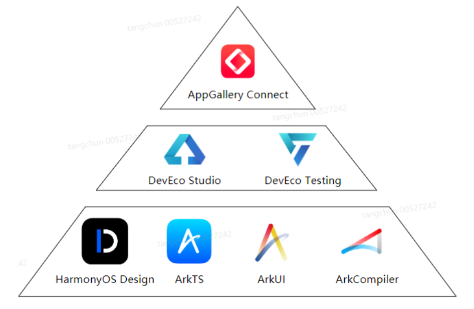

# 测试套件
## 测试标准
| 测试标准名称 | 测试标准覆盖范围说明                                                                               |
|--------------|----------------------------------------------------------------------------------------------------|
| 性能测试     | 任务启动时间、界面刷新帧率、应用内存占用及 CPU 占用等。                                            |
| 功耗测试     | 后台长驻任务/托管任务场景功耗、后台硬件器件资源/软件系统资源占用场景功耗及分布式资源占用场景功耗。 |
| 稳定性测试   | 长时间运行故障率（App Crash/App Freeze）、长时间运行内存泄漏及长时间运行踩内存等异常场景。         |
| 兼容性测试   | 应用和 OS 兼容、应用升级兼容、应用交互兼容及应用分布式兼容。                                       |
| UX测试       | 应用 UX 规范一致性、控件截断、文字截断、布局变形、图片模糊、黑边及白块等 UX 显示异常。             |
| 安全测试     | 基础安全、用户隐私、权限管理及跨设备安全。                                                         |
| 分布式测试   | 流转交互一致性、跨端迁移功能及多端协同功能。                                                       |
| 游戏测试     | 游戏音效、消息免打扰、帧率、屏幕点时延、GPU 使用率及后壳温度等。                                   |

## 测试工具
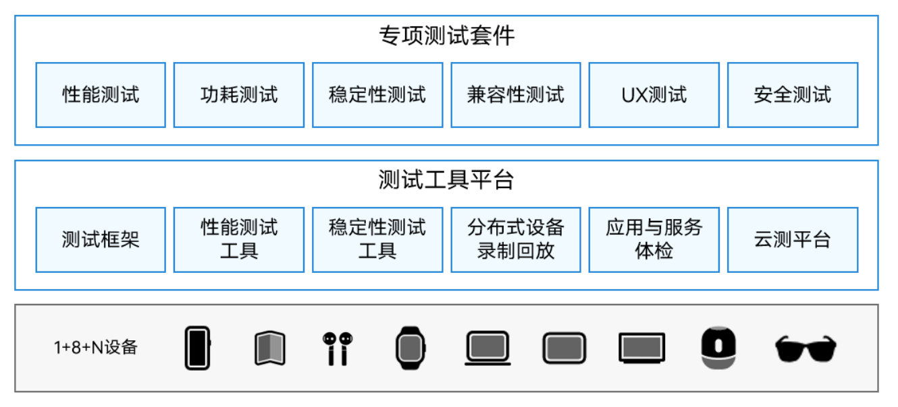

## 融合感知能力
|分类 |描述|
|-|-|
|空间感知    | 多设备空间感知模块，基于综合传感处理平台的空间感知原子算法能力，提供多设备间的空间感知结果，包括设备间距离、角度、方位关系等。|
|移动状态感知| 移动感知模块，通过加速度传感器、陀螺仪、磁力计、气压计等传感器及 Modem 基站信息，判断用户所处移动状态：乘车、步行、乘坐直梯、自行车、走、跑、静止、快步走、高铁、步行、电梯、相对静止、手持步行、躺卧、智能飞行、飞机、车载(不包含地铁、火车、高铁等轨道交通和自行车之外的交通工具)、停留、地铁。|
|设备状态感知| 设备状态服务，通过加速度传感器、陀螺仪、接近光等传感器及Modem 基站、Wi-Fi 扫描信息，判断用户手机状态：高精度静止、中精度静止等。|
|手势感知    | 能够感知操作手势，比如拿起、翻转、靠近耳朵、摇一摇、旋转、口袋模式、拿离耳朵、落腕、抬腕、招一招。|
|地理围栏    | 地理围栏服务，负责围栏监控及围栏进出事件上报。|
|时间线      | 时间线服务，根据移动感知的信息，区分家和公司的场景，保存一天内用户停留和移动的行为，用于智慧画像。|

# 方舟编译器（ArkCompiler）
- 支持支持包括动态类型和静态类型语言在内的多种编程语言，如 ArkTS、TS、JS。
- 将其编译生成为 ABC（ArkCompiler Bytecode，即方舟字节码）文件
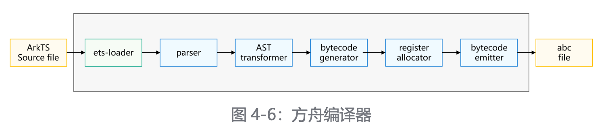
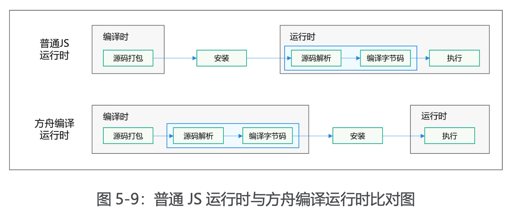

# ArkUI 框架
- 基于 ArkTS 的声明式开发范式（推荐）
- 基于 JS 扩展的类 Web 开发范式

# 集成开发环境
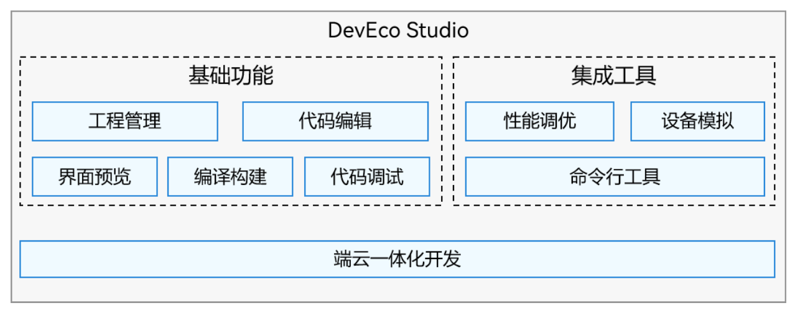

## HUAWEI DevEco Hvigor
- 是一款华为自研轻量级编译构建工具
- 支持多种语言（ArkTS、C/C++等）、多种产物类型的快速编译，最终生成 HAR/HSP/HAP/App 包

## 命令行工具
- ohpm：鸿蒙三方库的包管理工具，支持共享包的发布、安装和依赖管理。
- hdc：管理设备、本地和设备之间传输文件、安装和卸载应用、启动和终止应用。
- codelinter：支持代码检查及问题修复，用于检查代码规范、代码风格、安全及性能、最佳实践等。
- hstack：支持将混淆后的 crash 堆栈还原为源码对应的堆栈，用于快速定位 release应用的问题。
- bytrace：对内核 ftrace 进行了封装和扩展，配合应用打点，追踪进程轨迹，分析应用性能。

# 端云一体化开发
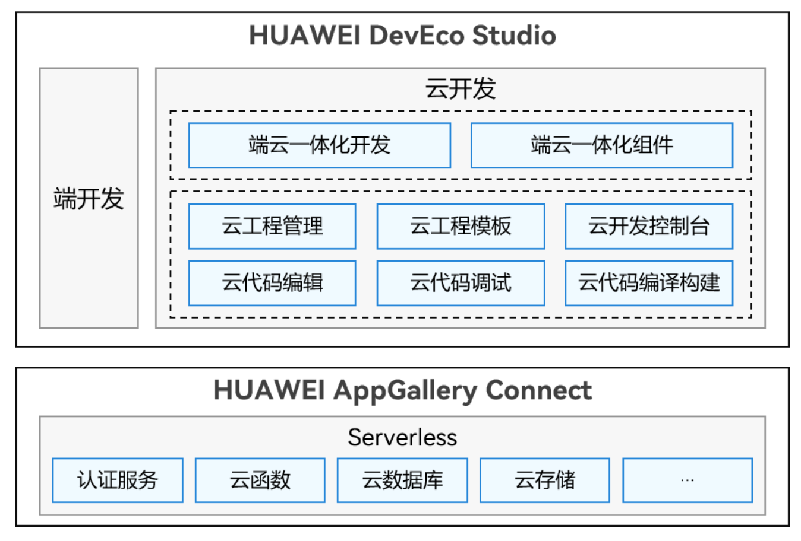

# HUAWEI AppGallery Connect
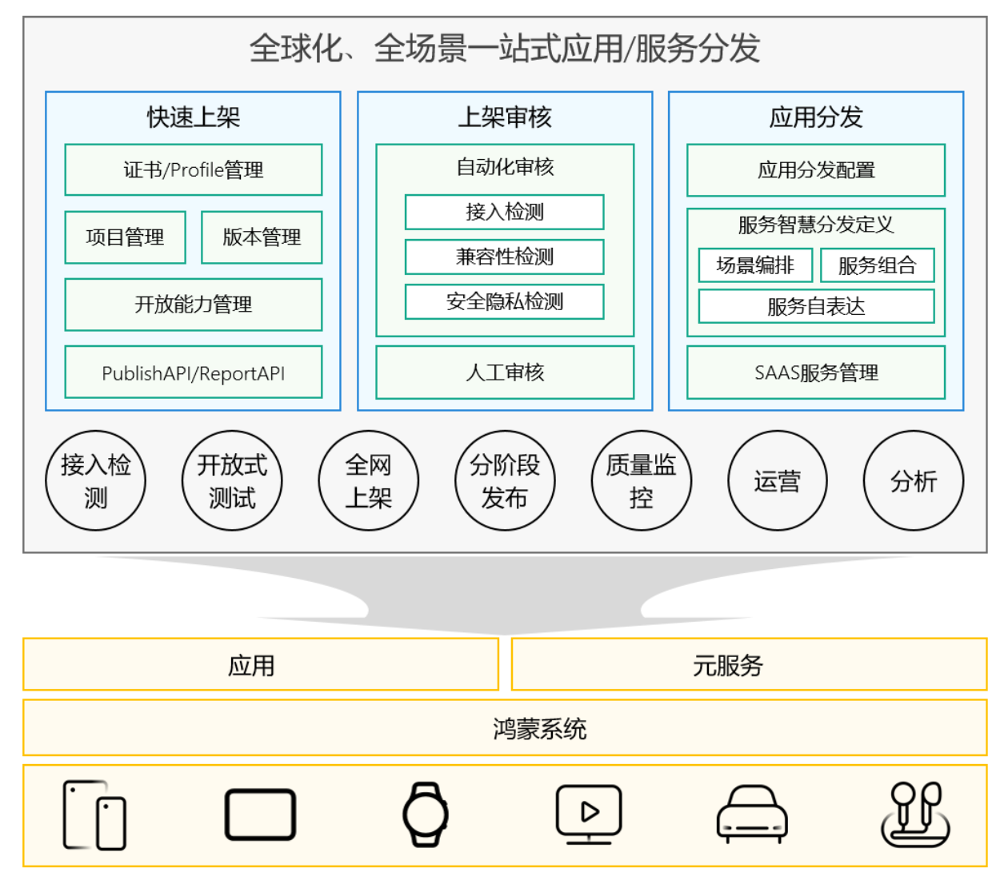

## 签名
- 每个应用中至少包含一个.hap文件，可能包含若干个.hsp文件
- 一个应用中的所有.hap与.hsp文件合在一起称为**Bundle**，其对应的bundleName是应用的唯一标识
- 当应用发布上架到应用市场时，**需要将Bundle打包为一个.app后缀的文件用于上架，这个.app文件称为App Pack（Application Package）**
- App Pack是发布上架到应用市场的基本单元，但是不能在设备上直接安装和运行。
- 在应用签名、云端分发、端侧安装时，都是以HAP/HSP为单位进行签名、分发和安装的。
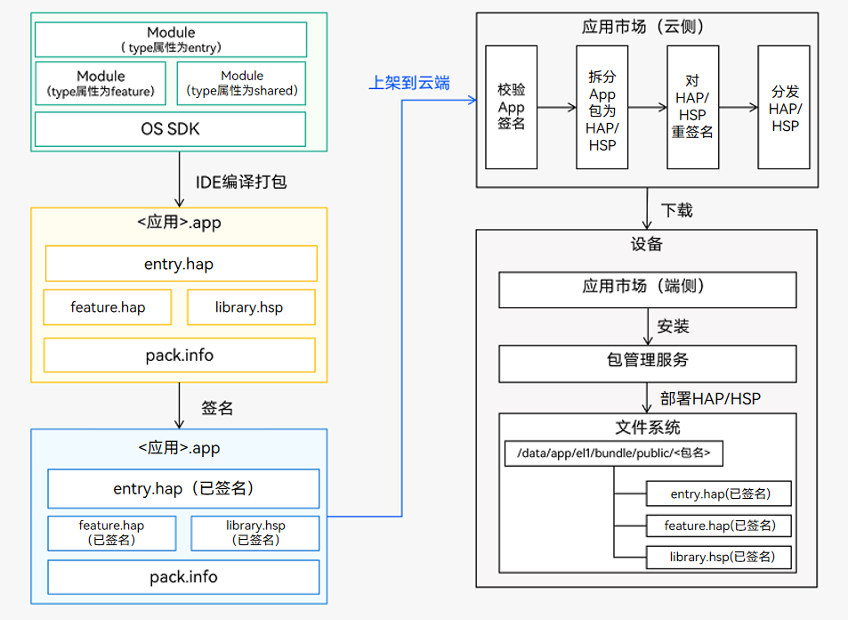
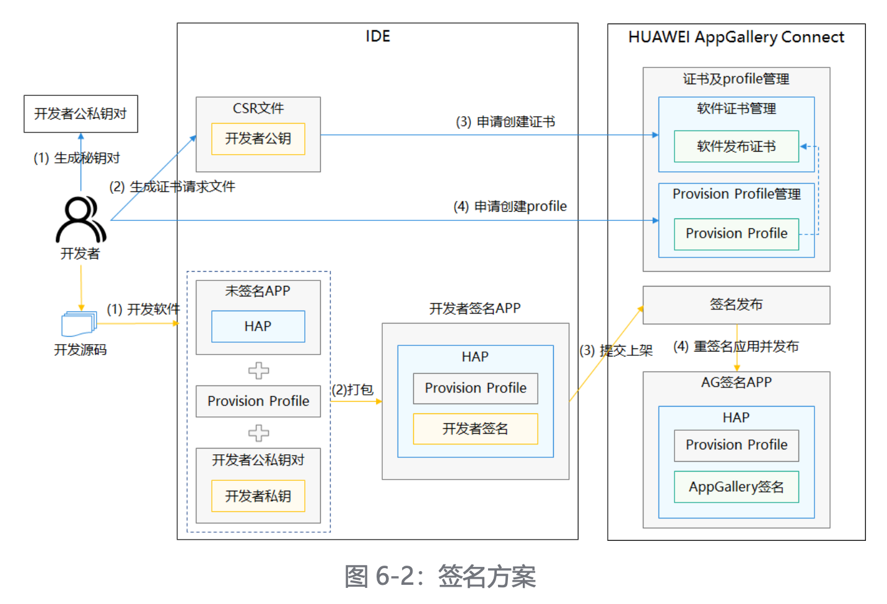

## 模块
- HAR（HarmonyOS Archive）：静态共享包
    - 这是一种中间编译产物格式，它最终将被编译合并到 HSP 或 HAP 格式的包中
- HSP（HarmonyOS Shared Package）：动态共享包
- HAP（HarmonyOS Ability Package）：HAP 包是鸿蒙应用可单独安装的容器包
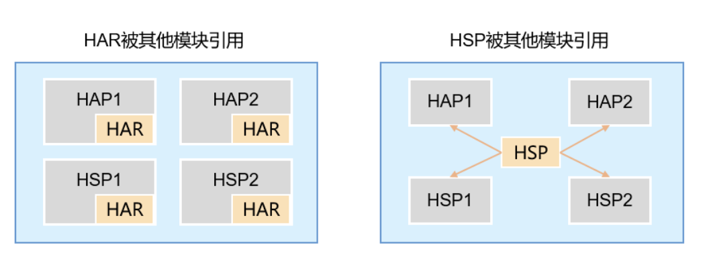
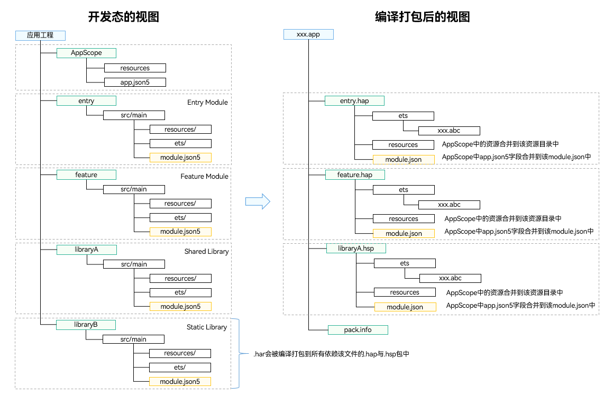

## 应用分发
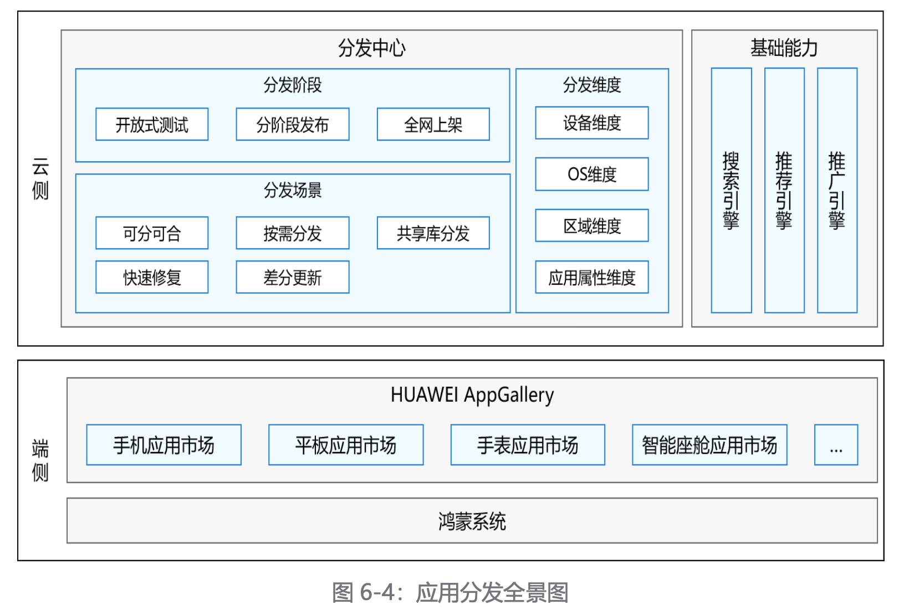
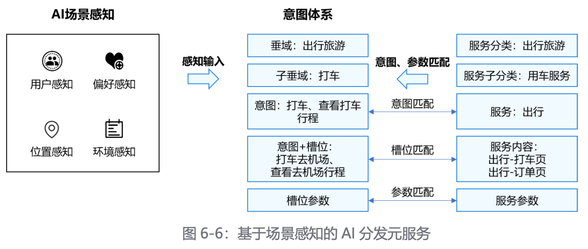

# 自由流转
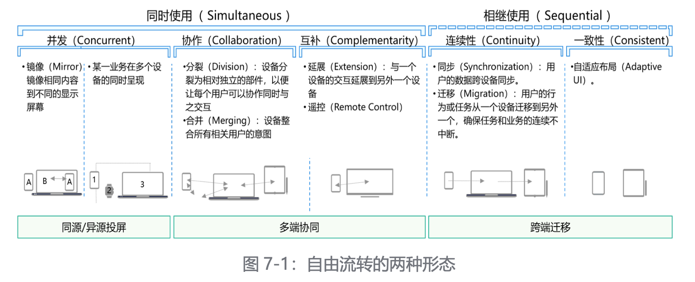

## 分布式运行环境
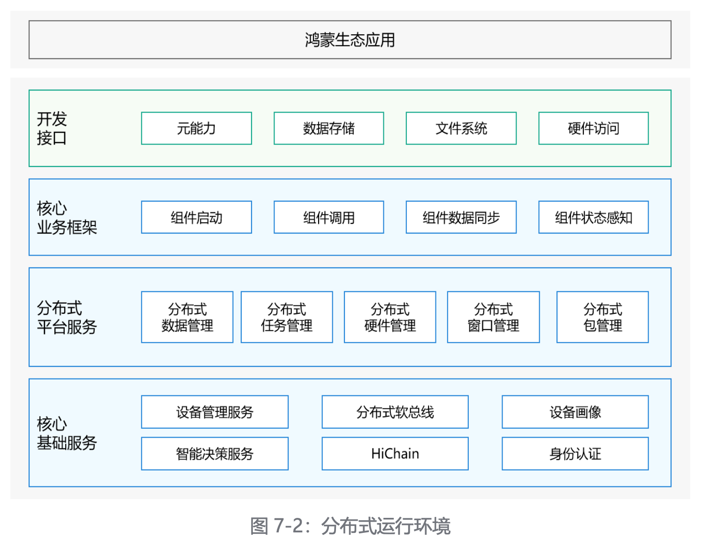

