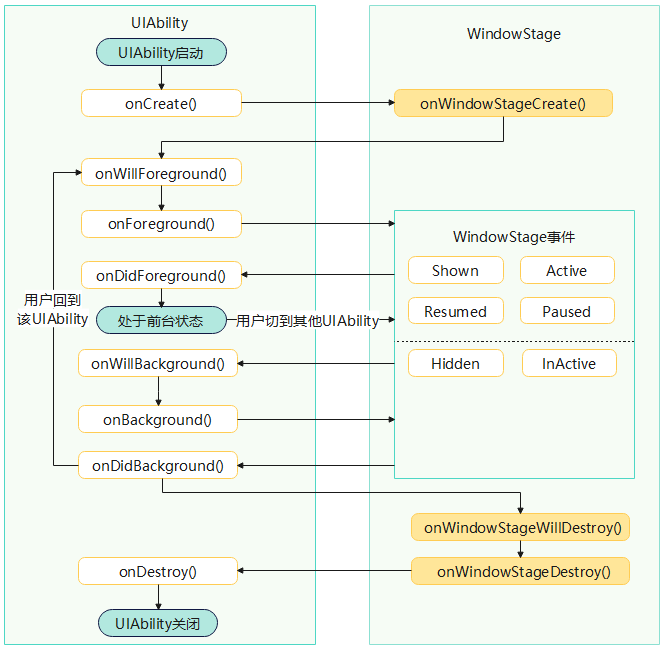
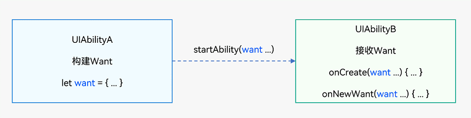

# UIAbility组件
UIAbility的设计理念
- 支持应用组件级的跨端迁移和多端协同。
- 支持多设备和多窗口形态

UIAbility划分原则
- UIAbility组件是系统调度的基本单元，为应用提供绘制界面的窗口
- 一个应用可以包含一个或多个UIAbility组件

UIAbility划分建议
- 如果开发者希望在任务视图中看到**一个任务**，建议使用“**一个UIAbility+多个页面**”的方式，可以避免不必要的资源加载
- 如果开发者希望在任务视图中看到**多个任务**，或者需要同时开启**多个窗口**，建议使用**多个UIAbility**实现不同的功能

## UIAbility组件生命周期
- https://developer.huawei.com/consumer/cn/doc/harmonyos-guides/uiability-lifecycle

- onNewWant()，当应用的UIAbility实例已创建，再次调用方法启动该UIAbility实例时，系统触发该UIAbility的onNewWant()回调

## UIAbility组件启动模式
- https://developer.huawei.com/consumer/cn/doc/harmonyos-guides/uiability-launch-type
- singleton（单实例模式），是默认的启动模式
- multiton（多实例模式）
- specified（指定实例模式）
    - 文档应用中每次新建文档希望都能新建一个文档实例
    - 重复打开一个已保存的文档希望打开的都是同一个文档实例

```
{
  "module": {
    "abilities": [
      {
        "launchType": "singleton",
      }
    ]
  }
}

Button().onClick(() => {
    let context: common.UIAbilityContext = this.getUIContext().getHostContext() as common.UIAbilityContext;
    let want: Want = {
    deviceId: '', // deviceId为空表示本设备
    bundleName: 'com.samples.stagemodelabilitydevelop',
    abilityName: 'SpecifiedFirstAbility',
    moduleName: 'entry', // moduleName非必选
    parameters: {
        // 自定义信息
        instanceKey: this.KEY_NEW
    }
    };
    context.startAbility(want)
    this.KEY_NEW = this.KEY_NEW + 'a';
})

 export default class MyAbilityStage extends AbilityStage {
   onAcceptWant(want: Want): string {
     // 在被调用方的AbilityStage中，针对启动模式为specified的UIAbility返回一个UIAbility实例对应的一个Key值
     // 当前示例指的是module1 Module的SpecifiedAbility
     if (want.abilityName === 'SpecifiedFirstAbility' || want.abilityName === 'SpecifiedSecondAbility') {
       // 返回的字符串KEY标识为自定义拼接的字符串内容
       if (want.parameters) {
         return `SpecifiedAbilityInstance_${want.parameters.instanceKey}`;
       }
     }
     // ...
     return 'MyAbilityStage';
   }
 }           
```

## 获取UIAbility的上下文信息 UIAbilityContext
- https://developer.huawei.com/consumer/cn/doc/harmonyos-guides/uiability-usage
- 可以在 UIAbility 和 Page 中获取 UIAbilityContext
- UIAbilityContext类拥有abilityInfo、currentHapModuleInfo等属性
- 可以获取UIAbility的相关配置信息，如包代码路径、Bundle名称、Ability名称和应用程序需要的环境状态等属性信息
- 操作UIAbility实例的方法（如startAbility()、connectServiceExtensionAbility()、terminateSelf()等）
```
import { UIAbility, AbilityConstant, Want } from '@kit.AbilityKit';
export default class EntryAbility extends UIAbility {
  onCreate(want: Want, launchParam: AbilityConstant.LaunchParam): void {
    // 获取UIAbility实例的上下文
    let context = this.context;
    // ...
  }
}

import { common, Want } from '@kit.AbilityKit';
@Entry
@Component
struct Page_EventHub {
  private context = this.getUIContext().getHostContext() as common.UIAbilityContext;
  build() {
  }
}
```

## UIAbility组件与UI的数据同步
- https://developer.huawei.com/consumer/cn/doc/harmonyos-guides/uiability-data-sync-with-ui
- 使用EventHub进行数据通信，先订阅，后发布，订阅者将接收到事件并进行相应处理
- AppStorage，实现应用级别的数据同步，适用于多个UIAbility共享同一状态数据的情况
- LocalStorage，实现UIAbility级别的数据同步，适用于单个UIAbility内部使用的状态数据

## 启动应用内的UIAbility组件
- 启动应用内的UIAbility，startAbility
- 启动应用内的UIAbility并获取返回结果，startAbilityForResult
- 启动UIAbility的指定页面
    - 目标UIAbility冷启动
        - UIAbility还没有启动
        - onCreate和onWindowStageCreate配合得到指定路由
    - 目标UIAbility冷启动
        - UIAbility已经启动了
        - onNewWant中得到路由

## 信息传递载体Want
- 显式Want与隐式Want匹配规则, 调用方传入的want参数中指定了abilityName和bundleName
- 使用显式Want启动应用组件        


## UIAbility备份恢复
https://developer.huawei.com/consumer/cn/doc/harmonyos-guides/ability-recover-guideline
- 当应用后台运行时，由于系统资源管控等原因导致应用关闭、进程退出
- 应用直接退出可能会导致用户数据丢失
- 在UIAbilityContext中启用了UIAbility备份恢复功能，并对临时数据进行保存
- 下一次启动时恢复先前的状态和数据（包括应用的页面栈以及onSaveState接口中保存的数据）
- **说明：应用正常关闭时，不会触发UIAbility备份流程**

运行机制
- UIAbility数据备份：在应用的onBackground生命周期后，系统自动调用onSaveState进行备份。
- UIAbility数据恢复：恢复的Want数据可以在应用的onCreate生命周期中获取，页面栈数据在应用的onWindowStageCreate生命周期中恢复。
