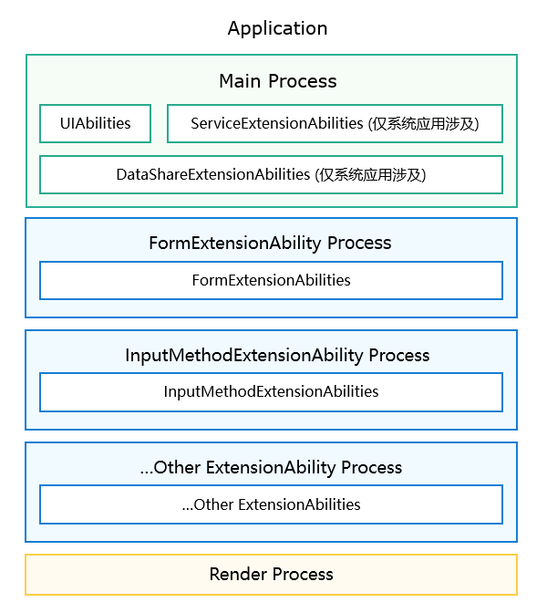
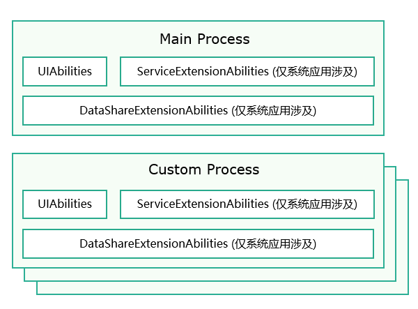

- 进程是系统进行**资源分配**的基本单位
- 线程是**运算调度**的基本单位

# 进程模型
- 应用中（同一Bundle名称）的所有UIAbility均是运行在同一个独立进程（主进程）中，如下图中**绿色部分**的“Main Process”。
- 应用中（同一Bundle名称）的所有同一类型ExtensionAbility均是运行在一个独立进程中，如下图中**蓝色部分**
- WebView拥有独立的渲染进程，如下图中**黄色部分**的“Render Process”。
- 说明：
    - 仅系统应用支持构建ServiceExtensionAbility和DataShareExtensionAbility。
    - 执行hdc shell命令，进入设备的shell命令行。在shell命令行中，执行ps -ef命令，可以查看所有正在运行的进程信息。

## 多进程
- 对于系统应用可以通过申请多进程权限
- 为指定HAP配置一个自定义进程名

# 线程类型
- 主线程
- TaskPool线程
    - 支持设置调度优先级、负载均衡等功能，推荐使用
    - TaskPool自行管理线程数量，其生命周期由TaskPool统一管理
- Worker线程
    - 支持线程间通信，使用EventHub进行线程内通信
    - Worker线程的生命周期由开发者自行维护

## 查看线程
- 执行hdc shell命令，进入设备的shell命令行。在shell命令行中，执行ps -p <pid> -T命令，可以查看指定应用进程的线程信息。
- 其中，<pid>为需要指定的应用进程的进程ID    