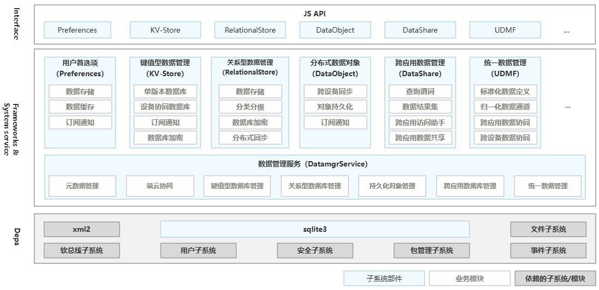

# ArkData （方舟数据管理）
- 提供数据存储、数据管理和数据同步能力

# 应用数据持久化
- 用户首选项（Preferences）
- 键值型数据库（KV-Store）
- 关系型数据库（RelationalStore）

## 用户首选项（Preferences）
- 对数据的操作主要发生在**内存**中，调用flush接口进行数据持久化
- 如果Value值为string类型，请使用UTF-8编码格式，可以为空，不为空时长度不超过16MB。

XML存储
- 针对单进程、小数据量场景
- 用户首选项默认使用XML格式进行存储

GSKV存储
- 从API version 18开始，可选择GSKV存储模式
- 支持多进程并发读写
- 对数据的操作会实时落盘

## 键值型数据库
- 设备协同数据库，针对每条记录，Key的长度≤896 Byte，Value的长度<4 MB。
- 单版本数据库，针对每条记录，Key的长度≤1 KB，Value的长度<4 MB。
- 每个应用程序最多支持同时打开16个键值型分布式数据库。
- 键值型数据库事件回调方法中不允许进行阻塞操作
- 大部分为**异步接口**，异步接口均有callback和Promise两种返回形式

## 关系型数据库
- 关系型数据库基于SQLite组件

## 向量数据库
- 是一种支持存储、管理和检索向量数据的数据库
- 也支持标量的关系型数据处理
- 从API version 18开始，支持通过向量数据库实现数据持久化

# 同应用跨设备数据同步
- 跨设备数据同步功能（即分布式功能）
- 将数据库中的数据同步到**组网环境中的其他设备**
- 例如：当设备1上的应用A在分布式数据库中增、删、改数据后，设备2上的应用A也可以获取到该数据库变化
- 根据跨设备同步数据生命周期的不同，可以分为：
    - 临时数据生命周期较短，通常保存到内存中。
    - 持久数据生命周期较长，需要保存到存储的数据库中，根据数据关系和特点，可以选择关系型数据库或者键值型数据库。