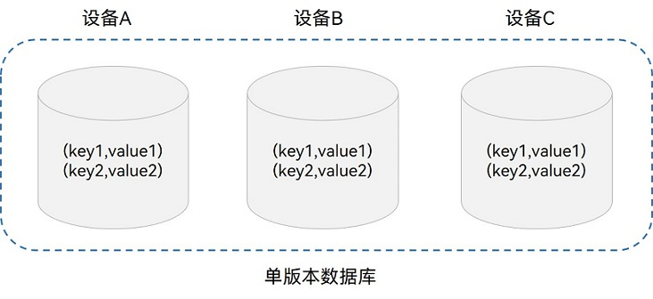
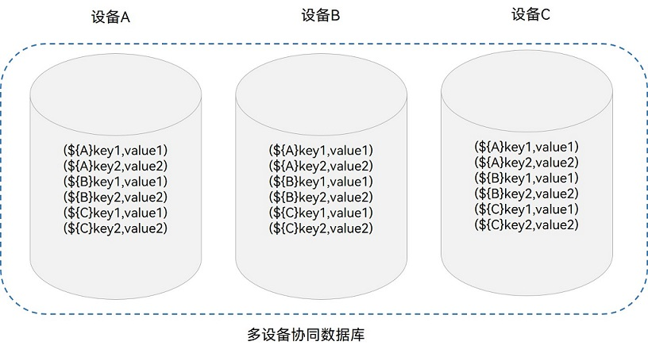
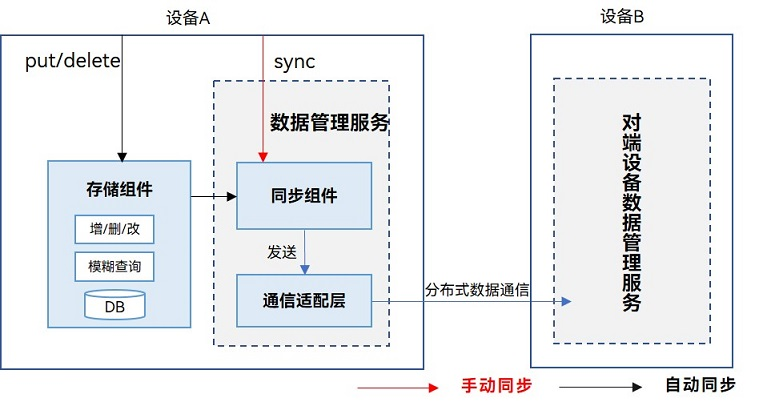
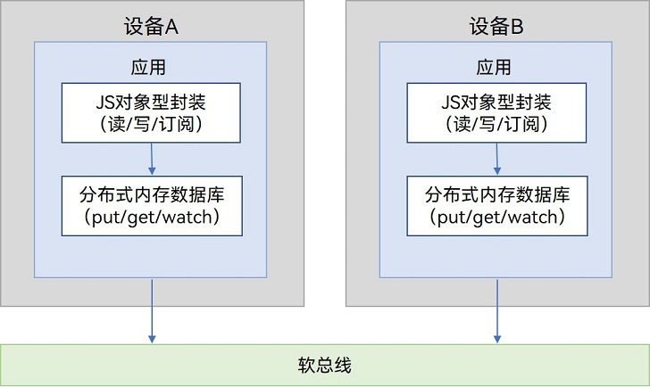
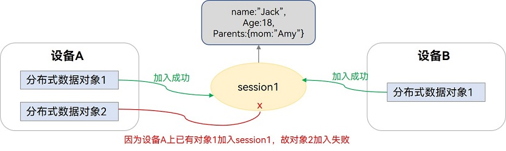
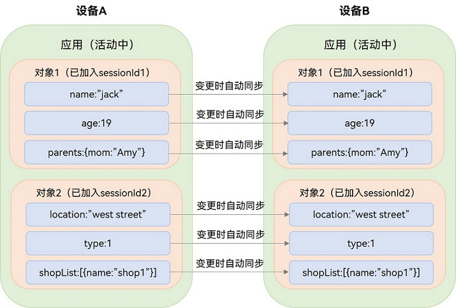

# 同应用跨设备数据同步
- 跨设备数据同步功能（即分布式功能）
- 将数据库中的数据同步到**组网环境中的其他设备**
- 例如：当设备1上的应用A在分布式数据库中增、删、改数据后，设备2上的应用A也可以获取到该数据库变化
- 根据跨设备同步数据生命周期的不同，可以分为：
    - 临时数据生命周期较短，通常保存到内存中。
    - 持久数据生命周期较长，需要保存到存储的数据库中，根据数据关系和特点，可以选择关系型数据库或者键值型数据库。

分布式数据库一致性
- 强一致性：是指某一设备成功增、删、改数据后，组网内任意设备**可立即读取数据获得更新后的值**。
- 弱一致性：是指某一设备成功增、删、改数据后，组网内设备可能读取到本次更新后的数据，也可能读取不到，**不能保证在多长时间后每个设备的数据一定是一致的**。
- 最终一致性
    - 是指某一设备成功增、删、改数据后，组网内设备可能读取不到本次更新后的数据，**但在某个时间窗口之后组网内设备的数据能够达到一致状态**。
    - 由于**移动终端设备**具有**不常在线且无中心的特点**，所以同应用跨设备数据同步**仅支持最终一致性**

## 关系型数据库跨设备数据同步
- 分布式表
- 数据同步
- 数据变化通知

数据变化通知机制
- 本地数据变化通知
- 分布式数据变化通知

## 键值型数据库跨设备数据同步
### 基本概念
- 单版本数据库
    - 数据在本地是以单个条目为单位的方式保存
    - 在数据端端同步后多个设备全局只保留一份数据
- 多设备协同数据库
    - 在单版本数据库之上，**在Key前面拼接了本设备的DeviceID**，这样能保证每个设备产生的数据严格隔离
    - 常用于图库缩略图存储场景

### 端端同步方式
- 手动同步
    - 由应用程序调用sync接口来触发
    - 同步模式分为PULL_ONLY（将远端数据拉取到本端）、PUSH_ONLY（将本端数据推送到远端）和PUSH_PULL（将本端数据推送到远端同时也将远端数据拉取到本端）
- 自动同步

## 分布式数据对象跨设备数据同步    
- 分布式数据对象即实现了对“变量”的“全局”访问
- 满足超级终端场景下，相同应用多设备间的数据对象协同需求。

基本概念
- 分布式内存数据库
- 分布式数据对象
    - 是一个JS对象型的封装
    - **分布式数据对象**在**分布式内存数据库**上进行了**JS对象型的封装**
    - 目前仅支持对根属性的修改，暂不支持对下级属性的修改
    

JS对象型存储与封装机制

