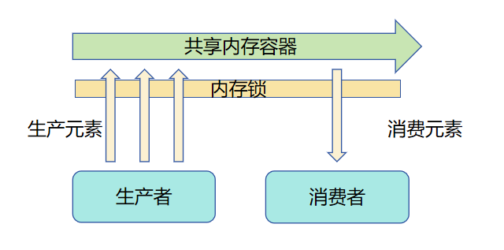
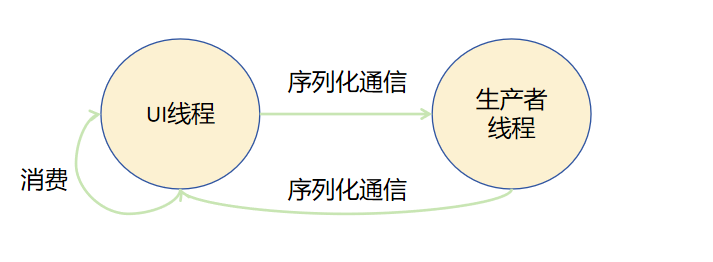
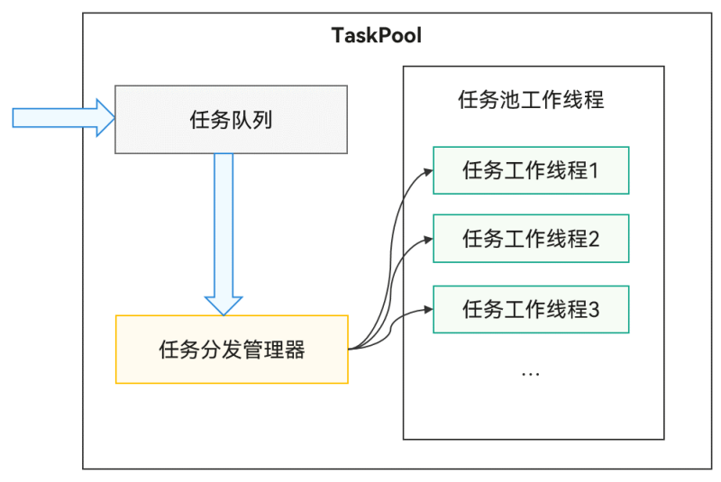

# 并发概述
- 异步并发
    - 指异步代码在执行到一定程度后暂停，并在未来某个时间点继续执行
    - 同一时间只有一段代码执行
    - 通过Promise和async/await提供异步并发能力，适用于单次I/O任务
- 多线程并发
    - 同时执行多段代码
    - 通过TaskPool和Worker提供多线程并发能力，适用于耗时任务等并发场景

# 异步并发
## Promise和async/await
- 是标准的JS异步语法，提供异步并发能力
- 异步代码执行时会被挂起，稍后继续执行，确保同一时间只有一段代码在运行
- 使用场景
    - I/O 非阻塞操作：网络请求、文件读写、定时器等。
    - 任务轻量且无 CPU 阻塞：单次任务执行时间短。
    - 逻辑依赖清晰：任务有明确的顺序或并行关系。

## Promise
- 通过状态机制管理异步操作的不同阶段
- 有三种状态：pending（进行中）、fulfilled（已完成，也叫resolved）和rejected（已拒绝）
- 创建后处于pending状态，异步操作完成后转换为fulfilled或rejected状态
```
const promise: Promise<number> = new Promise((resolve: Function, reject: Function) => {
  setTimeout(() => {
    const randomNumber: number = Math.random();
    if (randomNumber > 0.5) {
      resolve(randomNumber);
    } else {
      reject(new Error('Random number is too small'));
    }
  }, 1000);
})

// then 回调的两种写法
// 使用 then 方法定义成功和失败的回调, then使用了两个参数
promise.then(
  (result: number) => {
    console.info(`The number for success is ${result}`); // 成功时执行
  }, 
  (error: BusinessError) => {
    console.error(error.message); // 失败时执行
  }
);

// 使用 then 方法定义成功的回调，catch 方法定义失败的回调
// then使用了1个参数
promise.then((result: number) => {
              console.info(`Random number is ${result}`); // 成功时执行
            })
            .catch((error: BusinessError) => {
              console.error(error.message); // 失败时执行
            });
```

## async/await
- https://developer.huawei.com/consumer/cn/doc/harmonyos-guides/async-concurrency-overview#asyncawait
- async/await是用于处理异步操作的Promise语法糖，使编写异步代码更加简单和易读
- 使用async关键字声明异步函数，并使用await关键字等待Promise的解析（完成或拒绝），以同步方式编写异步操作的代码。
- async函数返回Promise对象

```
async function myAsyncFunction(): Promise<string> {
  const result: string = await new Promise((resolve: Function) => {
    setTimeout(() => {
      resolve('Hello, world!');
    }, 3000);
  });
  console.info(result); // 输出： Hello, world!
  return result;
}


@Entry
@Component
struct Index {
  @State message: string = 'Hello World';
  build() {
    Row() {
      Column() {
        Text(this.message)
          .onClick(async () => {
            let res = await myAsyncFunction();
            console.info('res is: ' + res);
          })
      }
      .width('100%')
    }
    .height('100%')
  }
}
```

# 多线程并发
内存共享模型
- 比如java的线程模型


Actor模型
- TaskPool和Worker均基于Actor并发模型实现
- 不同Actor之间不共享内存，需通过消息传递机制传递任务和结果


## TaskPool 和 Worker 比较
- 性能方面TaskPool优于Worker
- TaskPool偏向于独立任务，任务在线程中执行时，无需关注线程的生命周期。超长任务（大于3分钟且非长时任务）会被系统自动回收
- Worker适用于长时间占据线程的任务，需要开发者主动管理线程的生命周期

## TaskPool


## Worker
- 创建Worker的线程称为宿主线程（不局限于主线程，Worker线程也支持创建Worker子线程）
- 每个Worker子线程和宿主线程拥有独立的实例，包含独立执行环境、对象、代码段等
- Worker子线程和宿主线程通过消息传递机制通信，利用序列化机制完成命令和数据的交互
- Worker线程文件需要放在"{moduleName}/src/main/ets/"目录层级之下，否则不会被打包到应用中
- 配置build-profile.json5的相关字段信息，确保Worker线程文件被打包到应用中

# 线程间通信
- 并发任务间的通信采用了标准的Structured Clone算法（序列化和反序列化）
- JS对象 换转换 与引擎无关的数据（如字符串或内存块）

## 线程间通信对象
- 普通对象：可直接传递基本数据类型及自定义对象（需满足序列化规范）。
- ArrayBuffer对象：用于**二进制数据**的高效传递，适用于大段连续内存数据（如图片、音频原始数据）。
- SharedArrayBuffer对象：支持**多线程共享内存**，允许线程间直接访问同一块内存区域，提升数据传递效率。
- Transferable对象（NativeBinding对象）：支持跨线程转移对象所有权（如文件描述符、图形资源等），转移后原线程不再拥有访问权限。
- Sendable对象：符合ArkTS语言规范的可共享对象，需通过@Sendable装饰器标记，并且满足Sendable约束，详情可查Sendable使用规则与约束。