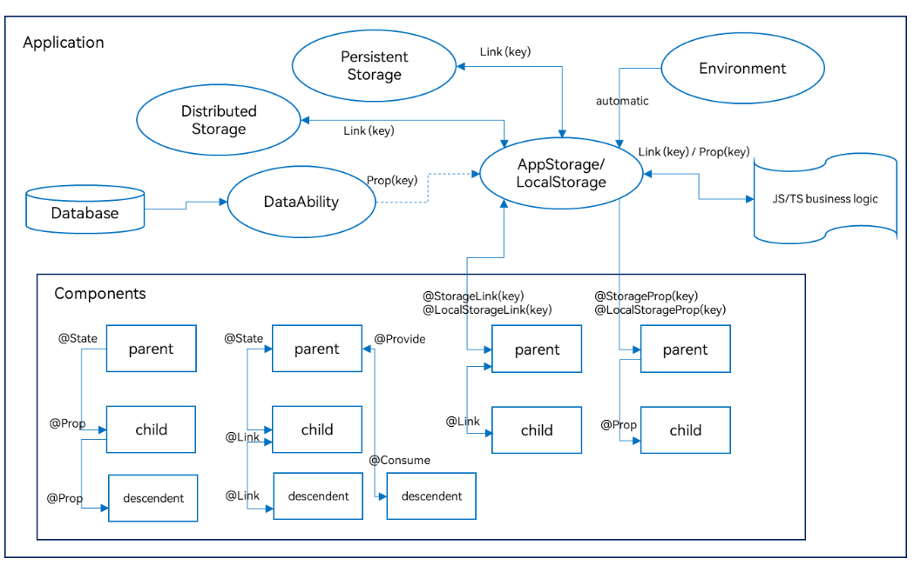

# 状态管理
- 当前状态管理分为V1、V2两个版本
- **V2是V1的增强版本**，正在持续迭代优化来为开发者提供更多功能和灵活性。
- 状态管理V1
    - 状态变量**不能独立于UI存在**
    - **只能感知对象属性第一层的变化**，无法做到深度观测和深度监听。
    - 在更改**对象中属性以及更改数组中元素**的场景下存在**冗余更新**的问题。
    - 装饰器间配合使用限制多，不易用。组件中**没有明确状态变量的输入与输出**，不利于组件化。
- 状态管理V2
    - **状态变量独立于UI**，更改数据会触发相应视图的更新。
    - 支持对象的**深度观测和深度监听**，且深度观测机制不影响观测性能。
    - 支持对象中**属性级精准更新及数组中元素的最小化更新**。
    - 装饰器易用性高、拓展性强，**在组件中明确输入与输出**，有利于组件化。
- 状态管理V1与V2能力对比    
    - https://developer.huawei.com/consumer/cn/doc/harmonyos-guides/arkts-state-management-overview#状态管理v1与v2能力对比    

# 状态管理V1

- 管理组件拥有的状态
- 管理应用拥有的状态
    - LocalStorage：页面级UI状态存储，通常用于UIAbility内
    - AppStorage：特殊的单例LocalStorage对象，由UI框架在应用程序启动时创建，为应用程序UI状态属性提供中央存储。
    - PersistentStorage
        - 持久化存储UI状态，通常和AppStorage配合使用，选择AppStorage存储的数据写入磁盘
        - PersistentStorage的存储路径为module级别
    - Environment：应用程序运行的设备的环境参数，会同步到AppStorage中，可以和AppStorage搭配使用。
- 其他状态管理
    - @Track装饰器
        - class对象属性级更新
        - 如果不使用 @Track， 当属性发生改变时，所有使用属性的对象对会更新
    - 自定义组件冻结功能
        - 设置freezeWhenInactive属性
        - 一种**性能优化**机制，降低复杂UI场景下的刷新负载
        - 系统将仅对处于**激活状态的自定义组件（仅限于用户可见范围内）**进行更新    
        - **如果不进行冻结，当state改变时，回退栈中的页面，或 tabContent 都会发生更新**

# 状态管理V2
- @ComponentV2装饰器：自定义组件
- @ObservedV2装饰器和@Trace装饰器：**类属性**变化观测        
- @Local装饰器
    - 组件内部状态
    - 观测能力仅限于被装饰的变量本身，比如**类本身**
- @Param：组件外部输入
- @Once：初始化同步一次
- @Event装饰器回调函数，**要求父组件更新@Param变量**
- @Provider装饰器和@Consumer装饰器
    - 跨组件层级双向同步
    - 支持回调function
- @Monitor装饰器：状态变量修改监听
- @Computed装饰器：计算属性
- @Type装饰器：
    - 标记类属性的类型
    - 配合PersistenceV2使用，防止序列化时类丢失
- @ReusableV2装饰器：组件复用
- Repeat, 可复用的循环渲染, **懒加载场景**
    - **Repeat与LazyForEach组件的区别**
        - Repeat直接监听状态变量的变化，而LazyForEach需要开发者实现IDataSource接口，手动管理子组件内容/索引的修改。
        - Repeat还增强了节点复用能力，提高了长列表滑动和数据更新的渲染性能。
        - Repeat增加了渲染模板（template）的能力，在同一个数组中，根据开发者自定义的模板类型（template type）渲染不同的子组件。