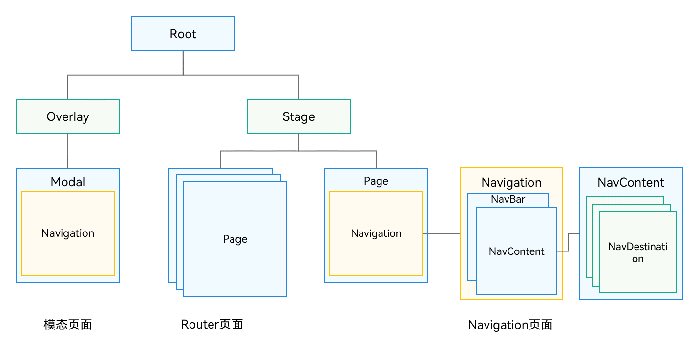

# 页面跳转
- **组件导航（Navigation）**和**页面路由（@ohos.router）**均提供了应用内的**页面跳转**能力
- **推荐使用组件导航（Navigation）**来实现页面跳转以及组件内的跳转
- 生命周期
    - 自定义组件的生命周期
        - https://developer.huawei.com/consumer/cn/doc/harmonyos-references/ts-custom-component-lifecycle#abouttoappear
    - 通用组件生命周期
        - https://developer.huawei.com/consumer/cn/doc/harmonyos-references/ts-universal-events-show-hide#onappear
    - Navigation 自有生命周期
        - https://developer.huawei.com/consumer/cn/doc/harmonyos-guides/arkts-navigation-navigation#页面生命周期
        - https://developer.huawei.com/consumer/cn/doc/harmonyos-guides/arkts-router-to-navigation#生命周期

## router页面的生命周期和Navigation页面的生命周期关系
https://developer.huawei.com/consumer/cn/doc/harmonyos-guides/arkts-router-to-navigation#生命周期
1. router页面的跳转会影响其内部Navigation页面的生命周期。
2. Navigation页面的跳转不会影响其所在router页面的生命周期。
3. 应用前后台切换会同时触发router页面和Navigation页面的生命周期。




# 组件导航（Navigation）
- 导航页
- 子页

## 导航页
- **Navigation**是路由导航的**根视图容器**，一般作为页面（@Entry）的根容器
- 包括单栏（Stack）、分栏（Split）和自适应（Auto）**三种显示模式**
- **Navigation**管理了**标题栏、内容区和工具栏**，可以通过**hideNavBar**属性进行隐藏
- 提供多种**标题栏样式**来呈现更好的标题和内容联动效果
- **导航页不存在路由栈中**

### 设置导航页显示模式        
- 自适应模式，NavigationMode.Auto
    - 当页面宽度大于等于一定阈值时，Navigation组件采用分栏模式，反之采用单栏模式。
- 单页面模式，NavigationMode.Stack

- 分栏模式，NavigationMode.Split


## 子页
- NavDestination是子页面的根容器
- NavDestination可以设置**独立的标题栏和菜单栏等属性**
- 跳转时也可以指定跳转模式
    - 比如 单例跳转：LaunchMode.MOVE_TO_TOP_SINGLETON
    - https://developer.huawei.com/consumer/cn/doc/harmonyos-references/ts-basic-components-navigation#launchmode12%E6%9E%9A%E4%B8%BE%E8%AF%B4%E6%98%8E

### 页面显示类型
- 标准类型 NavDestinationMode.STANDARD
- 弹窗类型 NavDestinationMode.DIALOG

### 生命周期
- **Navigation作为路由容器，其生命周期承载在NavDestination组件上**，以组件事件的形式开放
- 其生命周期大致可分为三类，自定义组件生命周期、通用组件生命周期和自有生命周期


```
@Component
struct PageOne {
  aboutToAppear() { // 自定义组件生命周期
  }

  onPageShow() {
  }

  build() {
    NavDestination() {
    }
    .onWillAppear(() => {   // 自有生命周期
    })
    .onAppear(() => {   // 通用组件生命周期
    })
    .onWillShow(() => {
    })
    .onShown(() => {
    })
    .onWillHide(() => {
    })
    .onHidden(() => {
    })
    .onWillDisappear(() => {
    })
    .onDisAppear(() => {
    })
  }
}
```

## 页面路由（@ohos.router）
- 页面栈的最大容量为32个页面
- 两种跳转模式, 提供了两种跳转模式，分别是pushUrl和replaceUrl
- 提供了两种实例模式，分别是Standard和Single
    - 说白了是针对 pushUrl 跳转模式的

### 生命周期

