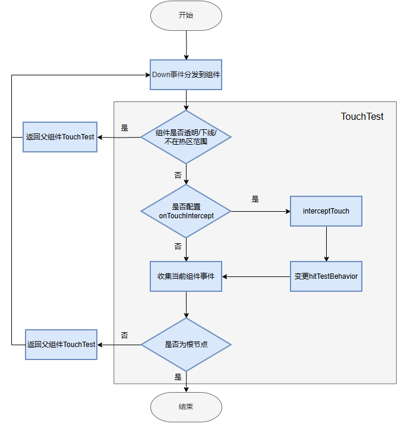

# 交互响应
- 支持直接处理**基础输入**事件
- 以及由这些事件驱动的**手势系统**

## 基础输入事件
- 通常以一个标志开始的事件作为起始，以一个标志结束的事件作为结尾
- 在两者之间，会持续上报众多移动或更新事件
- 触控事件的序列通常为Down, Move, Move..., Up
- 鼠标滚轮操作产生的轴事件的序列为Begin, Update, Update, ... End
- 分类
    - 指向性事件
        - 是指包含事件发生位置信息的事件
        - 以**第一个事件发生时所命中的组件**来确定**派发目标**
        - 包括：触摸事件，鼠标事件，轴事件
    - 非指向性事件
        - 是指没有具体位置信息的事件
        - 即事件的发生不依赖于特定的操作位置信息
        - 此类事件**以当前焦点组件**为**派发目标**

### 事件交互流程
https://developer.huawei.com/consumer/cn/doc/harmonyos-guides/arkts-interaction-basic-principles
- 事件产生
- 通过触摸测试建立事件响应链，并分发
    - 从子控件向父控件查找
    - 触摸热区，responseRegion
    - 自定义事件拦截，onTouchIntercept
    - 触摸测试控制，hitTestBehavior
- 响应回调

### 输入设备与事件
- 输入设备(source type)：如触摸屏、鼠标、触控板、键盘、摇杆等；
- 输入工具(source tool)：比如触摸屏上要产生触摸事件，那么可以使用的工具是手指或触控笔；
- 在很多情况下，**输入设备自己本身也可以作为输入工具**，如键盘、鼠标

## 手势系统
- 手势是一系列基础事件不断上报积累后，达成一定特点时所被识别成的交互结果
- 手势可以由组件内置默认绑定，也可以由应用显式绑定

### 绑定手势方法
- gesture（常规手势绑定方法）
- priorityGesture（带优先级的手势绑定方法），比如可以优先响应父控件
- parallelGesture（并行手势绑定方法），比如父控件和子控件同时响应

### 组合手势
- 顺序识别，比如先长按再拖动
- 并行识别
- 互斥识别