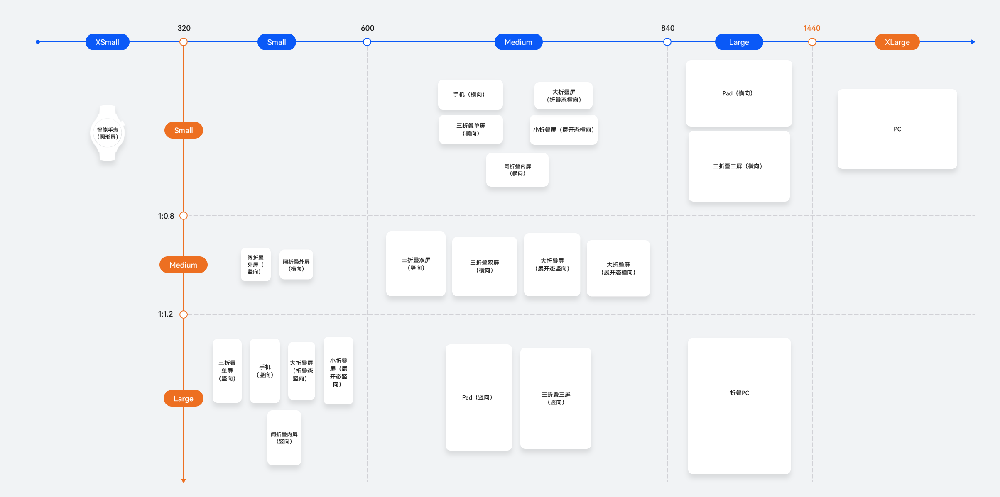

- 参考：[响应式布局-界面布局响应式变化-多设备界面开发-一次开发，多端部署)](https://developer.huawei.com/consumer/cn/doc/best-practices/bpta-multi-device-responsive-layout)
- 断点
	- 将窗口宽度及窗口高宽比划分为不同的范围，称之为“断点”
- 媒体查询
	- 媒体查询提供了丰富的媒体特征监听能力
	- 可以监听应用显示区域变化、横竖屏、深浅色、设备类型等

# 断点的定义
| 断点名称 | 窗口宽度（vp）    |
| :--- | :---------- |
| xs   | (0, 320）    |
| sm   | [320, 600)  |
| md   | [600, 840)  |
| lg   | [840, 1440) |
| xl   | [1440, +∞)  |

| 断点名称 | 高宽比        |
| :--- | :--------- |
| sm   | (0, 0.8)   |
| md   | [0.8, 1.2) |
| lg   | [1.2, +∞)  |

