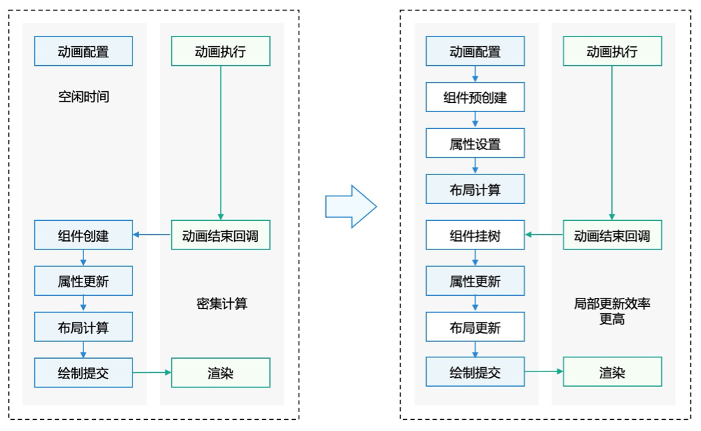

# 组件动态创建
- 为了解决页面、组件**加载缓慢**的问题
- ArkUI框架提供了动态操作以**实现组件预创建**，并允许应用在运行时**根据实际需要加载渲染相应的组件**
- 动态操作包含动态创建组件（动态添加组件）、动态卸载组件（动态删除组件）等相关操作
- 动态创建组件指**在非build生命周期中进行组件创建**，即在build生命周期前提前创建组件

## 组件预创建原理
- 组件预创建可以满足开发者在非build生命周期中进行组件创建，创建后的组件可以进行属性设置、布局计算等操作。
- 之后在页面加载时进行使用，可以极大提升页面响应速度


## 例子
- 实现 NodeController ，用于自定义节点的创建、显示、更新等操作的管理，并负责将自定义节点挂载到 NodeContainer 上。
- 实现 NodeController 的 makeNode 方法，makeNode会在NodeController实例绑定NodeContainer的时候进行回调，并将返回的节点挂载至NodeContainer。
- 使用 NodeContainer 显示自定义节点。

```
import { BuilderNode, FrameNode, NodeController } from '@kit.ArkUI';

class Params {
  text: string = 'Hello World';
  constructor(text: string) {
    this.text = text;
  }
}

@Builder
function buildText(params: Params) {
  Column() {
    Text(params.text)
  }
}

class TextNodeController extends NodeController {
  private textNode: BuilderNode<[Params]> | null = null;
  private message: string = '';

  constructor(message: string) {
    super();
    this.message = message;
  }

  makeNode(context: UIContext): FrameNode | null {
    if (this.textNode == null) {
      this.textNode = new BuilderNode(context);
      this.textNode.build(wrapBuilder<[Params]>(buildText), new Params(this.message));
    }
    return this.textNode.getFrameNode();
  }

  replaceBuilderNode(newNode: BuilderNode<Object[]>) {
    this.textNode = newNode;
    this.rebuild();
  }
}

@Entry
@Component
struct Index {
  @State message: string = "hello";
  @State isShow: boolean = true;
  private textNodeController: TextNodeController = new TextNodeController(this.message);

  build() {
    Row() {
      Column() {
        if (this.isShow) {
          NodeContainer(this.textNodeController)
            .backgroundColor('#FFF0F0F0')
        }
        Button('isShow')
          .onClick(() => {
            this.isShow = !this.isShow;
          })
        Button('replaceNode')
          .onClick(() => {
            this.textNodeController.replaceBuilderNode(this.buildNewNode());
          })
      }
    }
  }

  buildNewNode(): BuilderNode<[Params]> {
    let uiContext: UIContext = this.getUIContext();
    let message = 'newNode';
    let textNode = new BuilderNode<[Params]>(uiContext);
    textNode.build(wrapBuilder<[Params]>(buildText), new Params(message))
    return textNode;
  }
}

```