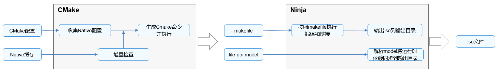

# 说明
- NDK（Native Development Kit）
- Native API、相应编译脚本和编译工具链的集合
- 只覆盖了基础的底层能力，如C运行时基础库libc、图形库、窗口系统、多媒体、压缩库、面向ArkTS/JS与C跨语言的Node-API等
- Node-API（NAPI）
    - 与Node.js中的Node-API不完全兼容

# ohos.toolchain.cmake
- HarmonyOS NDK默认使用CMake作为构建系统
- 基础配置文件ohos.toolchain.cmake，用于**预定义CMake变量**来简化开发者配置

## 参数
- OHOS_STL	c++_shared/c++_static
- OHOS_ARCH	armeabi-v7a/arm64-v8a/x86_64
- OHOS_PLATFORM	OHOS，当前只支持HarmonyOS平台
- 最终目的：上述参数最终会控制Clang的交叉编译命令，产生合适的命令参数
    - `--target={arch}-linux-ohos参数，通知编译器生成相应架构下符合HarmonyOS ABI的二进制文件。`
    - `--sysroot={ndk_root}/sysroot参数，告知编译器HarmonyOS系统头文件的所在位置。`

# NDK工程构建方式有
- 从源码构建
- 使用预构建库构建, 使用已经存在的库
    - https://developer.huawei.com/consumer/cn/doc/harmonyos-guides/build-with-ndk-prebuilts

# 编译
- NDK通过CMake和Ninja编译应用的C/C++代码
- 流程
    - 生成cmake：CMake配置脚本 + build-profile.json5中 externalNativeOptions 参数 + 缓存中的配置
    - 执行cmake
    - 执行Ninja



## externalNativeOptions
```
"apiType": "stageMode",
"buildOption": {
  "arkOptions": {
   },
  "externalNativeOptions": {
    "path": "./src/main/cpp/CMakeLists.txt",    #CMake构建脚本地址
    "arguments": "",        # CMake编译参数
    "cppFlags": "",         # C++编译器参数
    "abiFilters": [         # 本机的ABI编译环境
       "arm64-v8a",
       "x86_64"
    ],
  }
}
```

# NDK开发
- 位于: $DevEco Studio安装目录/sdk/default/openharmony/native
- 配置cmake环境变量，${实际SDK路径}/native/build-tools/cmake/bin
