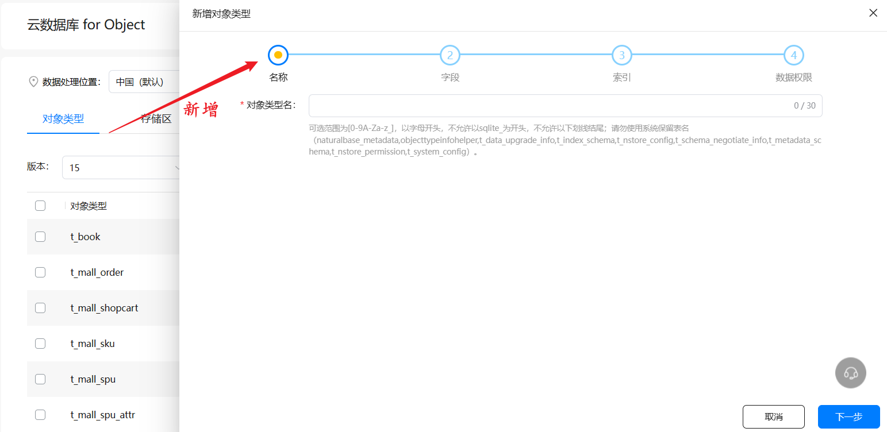
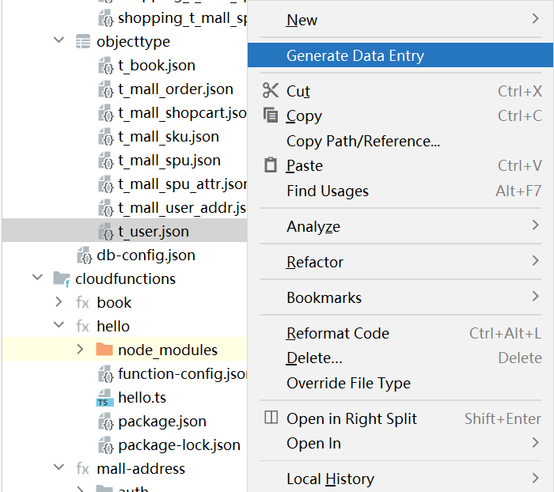

# 端云一体化
- 在 DevEco Studio 内使用一种语言同时完成**应用端**与**云侧**开发
- 两个关键点
    1. 一套开发工具，即 DevEco Studio 既能开发端侧代码、也能开发云侧代码
    2. 一套开发语言，端侧使用 ArtTS，云侧使用 TS
- 好处
  - 对于开发人员来说，统一工具，统一语言，能够降低开发成本，提高开发效率
  - 此外云侧开发，使用的各种云服务还具备免运维、零浪费的好处，能够降低运维成本

# 云开发（Serverless）
- 是一种按需提供云端服务的架构和服务模型。
- 应用运行所需的服务器和环境可以皆由云端平台提供，开发者只需关注应用的业务逻辑，而无需关心基础设施
- 提供丰富的Serverless模板，例如登录、抽奖、游戏排行榜等，开发者通过简单配置和少量代码，即可快速实现相关功能。

华为云开发服务框架


常见的云服务
- 认证服务：助力应用快速构建安全可靠的用户认证系统。
- 云函数： 提供Serverless化的代码开发与运行平台。
- 云数据库：提供端云数据的协同管理。
- 云缓存：为云函数提供Key-Value型高速缓存。
- 云存储：助力应用存储图片、音频、视频等内容，并提供高品质的上传、下载、分享能力。
- 云监控：提供云开发服务的运行指标、日志和告警，助力实时洞察服务运行状态。
- API网关：一个API开放平台，支持对多种API源的全生命周期管理。
- 云托管：提供网站的托管和静态CDN加速。
- 云应用引擎：提供包括部署、运行、运维在内的一站式应用托管方案。

华为云开发的优势
- 零运维成本, 无需构建和管理云端资源，云开发为您提供了包括计算、弹性收缩、存储等一系列能力
  - 业务代码
  - 数据存储（集群、中间件运维）
  - 中间件（集群、中间件运维）
  - 容器（集群、中间件运维）
  - OS（基础设施）
  - 虚拟化（基础设施）
  - 硬件（基础设施）
- 弹性伸缩、按量计费
  - 面对波峰波谷的业务场景，云开发可根据实际请求量弹性伸缩、按量计费，您无需为空闲资源买单，有效提升资源利用率，降低资源成本。
- 安全可靠
  - 支持数据全密态加密，支持APP、用户和服务三重认证，提供基于角色的权限管理机制，全方位保障您和用户的数据安全。
- 深度支撑应用构建
  - 提供主流应用平台及跨平台SDK，提供应用领域微解决方案，助力您提升应用开发效率。
- 端云一体化开发
  - 支持在一套IDE中基于统一的技术栈进行端、云代码的协同开发，前端开发人员轻松转换为全栈工程师。

# 云函数
- 云函数是一项Serverless计算服务，提供FaaS（Function as a Service）能力
- 一方面云函数将开发测试的对象聚焦到函数级别，可以帮助您大幅简化应用开发与运维相关的事务
- 另一方面您可以通过在应用中集成云函数SDK，便捷操作云数据库、云存储等，提升业务功能构建的便利性。
- 云函数可以根据函数的实际流量对函数进行弹性伸缩，您无需对服务器资源进行管理，解决了开发者运维管理的难题。

## 主要功能
| 主要功能       | 功能描述                                                     |
| -------------- | ------------------------------------------------------------ |
| 简化开发与运维 | 云函数提供了高效可靠的函数开发与运行框架，替开发者完全解决传统应用开发与运维中的诸多复杂事务（如服务器配置与管理、代码部署、负载均衡、弹性伸缩、高可用保证等等），您只需聚焦业务逻辑、开发并上传函数代码，即可构建高可用、可伸缩的Serverless应用。 |
| 扩展周边服务   | 云函数作为Serverless的核心与枢纽，支持方便连接和扩展周边云服务能力，您可以像拼搭积木一样自由便捷地组织各项服务来实现业务逻辑。 |

## 使用云函数服务流程
- 需要先在AppGallery Connect（简称AGC）上开发能够**实现云函数，并为函数添加触发其运行的触发器**
  - 在发起HTTP请求时触发运行的HTTP触发器
  - 集成云数据库服务后，进行删除或者插入数据操作时触发运行的云数据库触发器等
- 客户端集成云函数SDK并满足函数触发器的触发条件后，便可以实现云函数的调用，极大地便利了业务功能的构建。


## 开发云函数

### 1）新建项目和应用，开通云函数服务（AGC）
项目和应用的关系
* 一个项目包含多个应用
* 服务是在项目级别开通，开通后此项目下所有应用均可使用

在云侧为项目开通服务示例


### 2）使用端云一体化模板创建应用（DevEco Studio）
DevEco Studio 中 Create Project 创建的实际上对应着云侧的一个应用，模板选择示例如下


### 3）新建云函数（DevEco Studio）


### 4）编写云函数代码（DevEco Studio）
```ts
let myHandler = async function (event, context, callback, logger) {
  logger.info(event);
  if (event.httpMethod) {
    const json = JSON.parse(event.body)
    callback({
      code: 0,
      desc: `success`,
      debug: event.body,
      data: `Hello, ${json.name}`
    });
  } else {
    callback({
      code: 0,
      desc: `success`,
      debug: `${JSON.stringify(event)}`,
      data: `Hello, ${event.body.name}`
    });
  }
};
export { myHandler };
```

从上可见，其中：
* event 即为调用云函数的入参，这部分将来由 client 发送
  * 注意：不同方式触发的 event 格式会有不同，参见 [event对象](https://developer.huawei.com/consumer/cn/doc/AppGallery-connect-Guides/agc-cloudfunction-appx-event-0000001620581529#section12463185072710)
* context 函数执行上下文
  * 包括环境变量
  * 包括 PROJECT_CREDENTIAL 凭据信息
* callback 用来返回响应，响应中有哪些 key、value 是自定义的
* logger 用来记录日志，日志级别有 debug，info，warn 和 error

### 5）部署云函数（DevEco Studio）

* 部署云函数需要在 DevEco Studio 中以华为开发者账号登录
* 本地测试，需要使用华为提供的 node.js 环境

### 6）配置和测试（AGC）


执行测试


## 端侧调用云函数
### 1）添加依赖
在端侧的 oh-package.json5 中添加依赖（由端云一体化模板添加）
```json
"dependencies": {
  "@hw-agconnect/cloud": "^1.0.0",
  "@hw-agconnect/hmcore": "^1.0.0",
  "@hw-agconnect/auth-component": "^1.0.0",
  "long": "5.2.1"
}
```

### 2）初始化 AGConnect
下载  agconnect-services.json 文件（由端云一体化模板下载）


存放位置一般是
1. AppScope/resources/rawfile/agconnect-services.json
2. entry/resources/rawfile/agconnect-services.json

初始化代码一般放在 EntryAbility 中
```ts
import { initialize } from '@hw-agconnect/hmcore';
// @ts-ignore
import json from '../../resources/rawfile/agconnect-services.json'

export default class EntryAbility extends UIAbility {
  onCreate() {
    try {
      initialize(this.context, json);
    } catch (e) {
      hilog.error(0x0000, 'AGConnectError', JSON.stringify(e))
    }

    // ...
  }
}
```

### 3）ArkTS 界面开发
```ts
@Entry
@Component
struct MyIndex {
  @State message: string = ''

  build() {
    Row() {
      Column() {
        Button('调用云函数')
          .fontSize(20)
        Text(this.message)
          .fontSize(32)
          .fontWeight(FontWeight.Bold)
      }
      .width('100%')
    }
    .height('100%')
  }
}
```

### 4）ArkTS 调用云函数
```ts
import cloud from '@hw-agconnect/cloud'

@Entry
@Component
struct MyIndex {
  @State message: string = ''

  build() {
    Row() {
      Column() {
        Button('调用云函数')
          .fontSize(20)
          .onClick(async () => {
            const result = await cloud.callFunction({
              name: 'hello',
              version: '$latest',
              params: {}
            })
            this.message = result.getValue().message
          })
        Text(this.message)
          .fontSize(48)
          .fontWeight(FontWeight.Bold)
      }
      .width('100%')
    }
    .height('100%')
  }
}
```

* name 是云函数名
* version 是云函数版本，$latest 即为最新版本
* params 是输入参数，注意会封装在 event.body 中，且需要自己 JSON.parse


## 云函数开发细节
### 1）传参问题
通过 ArkTS 端侧调用的云函数，要正确接收输入参数，需要用 JSON.parse(event.body) 解析后方能使用

### 2）环境变量


### 3）流量治理
负载均衡策略


* 随机 - 将调用请求分配至随机实例
* 轮询 - 将调用请求依次分配至每一实例
* 最少连接 - 将调用请求分配至活动连接最少的实例
* 响应时间 - 将调用请求分配至处理请求最快的实例

重试策略


* zero - 函数调用失败后立刻发起重试，多次重试之间也没有间隔
* constant - 函数调用失败后等待常量时间后发起重试，多次重试之间间隔常量时间
* jittered - 函数调用失败后多次重试之间的时间间隔不断增长，增长方式是指数时间

熔断策略


* 云函数会在调用失败满足下面条件后触发熔断，熔断后云函数暂停对外服务
  * 10s 内函数调用错误次数达到【熔断请求阈值】
  * 10s 内函数调用错误次数达到【熔断错误百分比阈值】
  * 二者是【或】的关系
* 熔断后会在等待【熔断时长】后，进入半熔断状态
  * 此时会允许部分请求对云函数的访问
    * 如果这些调用成功率达到要求，则完全开放对外服务
    * 否则，则重新进入熔断状态
  * 其中细节并未在文档中提及

# 认证系统
## 用登录组件实现
客户端代码
```ts
Login({
  modes: [AuthMode.PHONE_VERIFY_CODE],
  onSuccess: (user: AuthUser) => {
    router.replaceUrl({ url: 'pages/MyWelcome' })
  }
}) {
  Button('登录')
}
```

几个要点
* modes：用来选择认证方式，目前对 ArkTS 来说，只支持手机认证和邮箱认证
* onSuccess：认证成功的回调，可以用 router 跳转至某页面，建议用 replaceUrl 跳转（防止后退）
  * 回调函数会拿到用户参数（AuthUser）
  * 如果用户还不存在，默认会自动创建
* onError：认证失败的回调，不用实现，Login 组件有默认实现（弹窗提示）
* Button 不用声明 onClick 实现，Login 组件有默认实现


## 认证流程
、


## 用户信息
获得 AuthUser 对象后，有如下较为有用的方法

| 方法名           | 作用                       | 备注         |
| ---------------- | -------------------------- | ------------ |
| getUid()         | 获取用户唯一标识           |              |
| getPhone()       | 获取手机号                 | 使用手机认证 |
| getEmail()       | 获取邮件地址               | 使用邮箱认证 |
| getUserExtra()   | 获取用户创建、最近登录时间 |              |
| getDisplayName() | 获取昵称                   |              |
| getPhotoUrl()    | 获取头像地址               |              |
| getToken(false)  | 获取 Token                 |              |

* 昵称和头像最初没有值，需要调用 updateProfile 更新后才有值
* 密码最初也没有值，需要调用 updatePassword 更新后才有值


## 用基础 API 实现
需求：
* 不使用 Login 组件
* 倒计时实现
* 发送验证码的实现
* 登录的实现

MyLoginCustom.ets
```ts
import cloud, { VerifyCodeAction } from '@hw-agconnect/cloud'
import hilog from '@ohos.hilog'
import router from '@ohos.router'

@Entry
@Component
struct MyLoginCustom {
  @State countDown: number = 10
  intervalId: number = 0
  @State verifyCodeButtonText: string = '获取验证码'
  @State verifyCodeButtonEnable: boolean = true
  @State phoneNumber: string = ''
  @State verifyCode: string = ''

  waiting() {
    this.verifyCodeButtonText = `${this.countDown} s`
    this.verifyCodeButtonEnable = false
    this.intervalId = setInterval(() => {
      this.verifyCodeButtonText = `${this.countDown} s`
      this.countDown--
      if (this.countDown < 0) {
        clearInterval(this.intervalId)
        this.countDown = 10
        this.intervalId = 0
        this.verifyCodeButtonText = '获取验证码'
        this.verifyCodeButtonEnable = true
        return
      }
      this.countDown--
    }, 1000)
  }

  async login() {
    try {
      const result = await cloud.auth().signIn({
        credentialInfo: {
          kind: 'phone',
          countryCode: '86',
          phoneNumber: this.phoneNumber,
          verifyCode: this.verifyCode
        }
      })
      const user = result.getUser()
      hilog.info(0, 'Login', 'Success')
      router.replaceUrl({ url: 'pages/MyWelcome' })
    } catch (e) {
      AlertDialog.show({ title: '错误', message: '登录失败' })
      hilog.error(0, 'Login', JSON.stringify(e))
    }
  }

  async sending() {
    try {
      await cloud.auth().requestVerifyCode({
        verifyCodeType: {
          kind: 'phone',
          phoneNumber: this.phoneNumber,
          countryCode: '86'
        },
        action: VerifyCodeAction.REGISTER_LOGIN,
        lang: 'zh_CN',
        sendInterval: 10
      })
      hilog.info(0, 'VerifyCode', 'Success')
    } catch (e) {
      AlertDialog.show({ title: '错误', message: '验证码发送失败' })
      hilog.error(0, 'VerifyCode', JSON.stringify(e))
    }
  }

  build() {
    Row() {
      Column({ space: 10 }) {
        Text('登录')
          .fontSize(40)
          .fontWeight(FontWeight.Bold)
        Divider()
        TextInput({ placeholder: '请输入手机号' })
          .width('80%')
          .type(InputType.Number)
          .onChange(value => {
            this.phoneNumber = value
          })
        Row({ space: 10 }) {
          TextInput({ placeholder: '请输入验证码' })
            .width('55%')
            .type(InputType.Number)
            .onChange(value => {
              this.verifyCode = value
            })
          Button(this.verifyCodeButtonText)
            .enabled(this.verifyCodeButtonEnable)
            .onClick(async () => {
              this.waiting()
              this.sending()
            })
        }
        .width('80%')
        .justifyContent(FlexAlign.SpaceBetween)

        Button('登录')
          .enabled(this.phoneNumber.length === 11 && this.verifyCode.length === 6)
          .onClick(async () => {
            this.login()
          })
      }
      .width('100%')
    }
    .height('100%')
  }
}
```

需求
* 登出功能
* 登录后，设置用户头像和昵称
  * 头像图片固定
* 用户头像从相簿选择，上传至云存储

MyIndex.ets
```ts
import cloud, { AuthUser } from '@hw-agconnect/cloud'
import router from '@ohos.router'
import hilog from '@ohos.hilog'
import picker from '@ohos.file.picker'

@Entry
@Component
struct MyIndex {
  @State photoUrl: string = ''
  @State displayName: string = ''
  @StorageLink('user') user: AuthUser = null

  aboutToAppear() {
    // 1. cloud.auth().getCurrentUser()
    // 2. AppStorage
    this.displayName = this.user.getDisplayName()
    this.photoUrl = this.user.getPhotoUrl()
  }

  build() {
    Row() {
      Column({ space: 10 }) {
        Image(this.photoUrl ? this.photoUrl : $r('app.media.user_dark'))
          .width(70).height(70)
          .onClick(async () => {
            // this.photoUrl = 'https://img.zcool.cn/community/01a6095f110b9fa8012066219b67d4.png@1280w_1l_2o_100sh.png'
            try {
              // 1. 从相簿中选照片
              const options = new picker.PhotoSelectOptions()
              options.MIMEType = picker.PhotoViewMIMETypes.IMAGE_TYPE
              options.maxSelectNumber = 1
              const result = await new picker.PhotoViewPicker().select(options)
              hilog.info(0, 'Upload', `Picker Success ${result.photoUris[0]}`)
              // 2. 调云存储 api 上传照片
              await cloud.storage().upload({
                localPath: result.photoUris[0],
                cloudPath: `test/${this.user.getUid()}.jpg`
              })
              hilog.info(0, 'Upload', 'Upload Success')
              // 3. 获取上传照片的网络地址
              const url = await cloud.storage().getDownloadURL(`test/${this.user.getUid()}.jpg`)
              this.photoUrl = url
              hilog.info(0, 'Upload', `url: ${url}`)
            } catch (e) {
              hilog.error(0, 'Upload', JSON.stringify(e))
            }
          })
        TextInput({ placeholder: '请设置昵称', text: this.displayName })
          .width('50%')
          .onChange(value => {
            this.displayName = value
          })
        Button(`保存`)
          .onClick(async () => {
            try {
              await this.user.updateProfile({
                displayName: this.displayName,
                photoUrl: this.photoUrl
              })
              hilog.info(0, 'updateProfile', 'Success')
            } catch (e) {
              hilog.error(0, 'updateProfile', JSON.stringify(e))
            }
          })
        Button(`登出`)
          .onClick(async () => {
            try {
              await cloud.auth().signOut()
              hilog.info(0, 'SignOut', 'Success')
              router.replaceUrl({ url: 'pages/MyLoginCustom' })
            } catch (e) {
              hilog.error(0, 'SignOut', JSON.stringify(e))
            }
          })

      }
      .width('100%')
    }
    .height('100%')
  }
}
```

* 问题1：图片缓存问题
* 问题2：真机调试日志问题
* 问题3：权限问题
* 问题4：上传进度实现
* 问题5：提示【用户已登录】，不能登录问题


* 问题6：照片上传成功，但相簿中保存的网络图片上传失败问题
  * 咨询了华为工程师，是因为我的云存储的历史策略有问题
    
  * 正常的安全配置策略是有历史策略这部分的，我的一开始没有
  * 修正方法是将安全策略配置的内容备份一下，修改一下重新发布，最后再改回初始的内容，就有历史策略了，之后上传文件也会正常。

# 云数据库
## 概念

### 数据模型
云数据库是一款基于对象模型的数据库，采用**存储区**、**对象类型**和**对象**三级结构。


- 存储区（CloudDBZone）是一个独立的数据存储区域，多个数据存储区相互独立。每个存储区拥有完全相同的对象类型定义，您可以根据业务的需要自定义存储区中存储的对象。
  - P.S. 可以用存储区隔离测试、正式数据
- 对象类型（ObjectType）用于定义存储对象的集合，不同的对象类型对应的不同数据结构。
  - P.S. 类似于关系型数据库中的表
- 对象（CloudDBZoneObject）是云数据库的基本操作单元，每一个对象，都是一条完整的数据记录。
  - P.S. 类似于关系型数据库中的表中一条记录

### 数据类型

| 数据类型          | 取值范围                  | 说明                                                         | 排序方式                  |
| ----------------- | ------------------------- | ------------------------------------------------------------ | ------------------------- |
| String            | 最大长度200               | 如果字符串长度超过200，建议使用Text类型。                    | 采用 UTF-8 编码的字节顺序 |
| Boolean           | true/false                | -                                                            | false < true              |
| Byte              | $(-2^7)\sim(2^7-1)$       | -                                                            | 数字顺序                  |
| Short             | $(-2^{15})\sim(2^{15}-1)$ | -                                                            |                           |
| Integer           | $(-2^{31})\sim(2^{31}-1)$ | -                                                            |                           |
| Long              | $(-2^{63})\sim(2^{63}-1)$ | 由于JavaScript不支持数据类型“Long”，Web SDK通过引入第三方开源组件实现支持数据类型“Long”的能力。“Long”类型的使用方法请参考https://github.com/dcodeIO/long.js。 |                           |
| Float             | -3.40E+38 ~ +3.40E+38     | -                                                            |                           |
| Double            | -1.79E+308 ~ +1.79E+308   | -                                                            |                           |
| ByteArray         | -                         | 一般用于文件类型的数据存储，如图片、文档和视频等。在端侧时，使用Android开发应用时，以byte[]表示为字节数组。 | 采用 UTF-8 编码的字节顺序 |
| Text              | -                         | -                                                            |                           |
| Date              | -                         | -                                                            | 时间顺序                  |
| IntAutoIncrement  | $1\sim(2^{31}-1)$         | Android、HarmonyOS(Java)和iOS不支持此数据类型。              | 数字顺序                  |
| LongAutoIncrement | $1\sim(2^{63}-1)$         | Android、HarmonyOS(Java)和iOS不支持此数据类型。              | 数字顺序                  |

* 假设有自增类型 id，执行 upsert （insert+update）
  * id 值在数据库有，更新  {id:1, name:'李四' , age:20}
  * id 值在数据库无，按自增添加 {id:5, name:'王五' , age:16}
  * id 值不给，也按自增添加 {name:'赵六' , age:16}

```
student 表
id	 name   age
1    李四    20
2    王五    16
3	 赵六    16
```

### 权限管理

【角色】共有四种

* World 所有人
* Authenticated 已认证
* Creator 创建者
* Administrator 管理员

【权限】共有三种：Read 查询、Upsert 新增和修改、Delete 删除

例如

```
article 表
id	title  								
											用户 111
1   探索自我成长的道路：我的心路历程
2   如何在忙碌的生活中保持身心健康
3   分享我的旅行经历：探索世界的美
											用户 222
4	金融投资的新趋势：数字货币的崛起
5   未来科技发展展望：人工智能对社会的影响
```

1. 用户111 未登录，查询所有文章	1 2 3 4 5
2. 用户333 未登录，查询所有文章        1 2 3 4 5
3. 用户111 未登录，添加新文章            失败
4. 用户111 已登录，添加新文章            成功
5. 用户111 已登录，删除文章1              成功
6. 用户111 已登录，删除文章4             失败
7. 用户111 已登录，修改文章4             成功

它的权限设置如下：

```json
"permissions": [
  {
    "rights": ["Read"],
    "role": "World"
  },
  {
    "rights": ["Read","Upsert"],
    "role": "Authenticated"
  },
  {
    "rights": ["Read","Upsert","Delete"],
    "role": "Creator"
  },
  {
    "rights": ["Read","Upsert","Delete"],
    "role": "Administrator"
  }
]
```

则有：
* 未认证（未登录）的用户只能查询
  * 这时最好不要给 Upsert 权限，否则由未认证的用户新增的数据，除了管理员都不能删除
* 已认证的用户可以查询、新增、修改
* 已认证的用户自己新增的数据，自己可以删除，别人的数据不能删除（但可以修改）
* 已认证用户查询时，还是能查到其它用户的数据的，因此需要自己维护 uid 来控制数据权限

## 准备云数据库

### 1）新增存储区

### 2）新建对象类型（表）
可以在应用中创建

也可以用 AGC 管理端网页创建（按照向导提示，一步步完成创建）

* **注意**：网页导入、导出的 json 格式与应用中不同，不要混用


例如，创建了 t_user 数据类型如下
```json
{
  "fields": [
    {
      "belongPrimaryKey": true,
      "fieldName": "id",
      "fieldType": "IntAutoIncrement",
      "isNeedEncrypt": false,
      "notNull": true
    },
    {
      "belongPrimaryKey": false,
      "fieldName": "name",
      "fieldType": "String",
      "isNeedEncrypt": false,
      "defaultValue": "",
      "notNull": true
    },
    {
      "belongPrimaryKey": false,
      "fieldName": "birthday",
      "fieldType": "Date",
      "isNeedEncrypt": false,
      "notNull": false
    }
  ],
  "indexes": [
    {
      "indexName": "idIndex",
      "indexList": [
        {
          "fieldName": "id",
          "sortType": "ASC"
        }
      ]
    }
  ],
  "objectTypeName": "t_user",
  "permissions": [
    {
      "rights": ["Read"],
      "role": "World"
    },
    {
      "rights": ["Read","Upsert"],
      "role": "Authenticated"
    },
    {
      "rights": ["Read","Upsert","Delete"],
      "role": "Creator"
    },
    {
      "rights": ["Read","Upsert","Delete"],
      "role": "Administrator"
    }
  ]
}
```

### 3）添加对象数据


```json
{
  "cloudDBZoneName": "shopping",
  "objectTypeName": "t_user",
  "objects": [
    {
      "id": 1,
      "name": "张三",
      "birthday": 1702001256870
    },
    {
      "id": 2,
      "name": "李四",
      "birthday": 1702001256870
    }
  ]
}
```

其中 cloudDBZoneName 是存储区名称，需要在管理端网页创建好
* 不同的存储区可以用来分别存储测试与正式数据
* 如果 cloudDBZoneName 在云端还不存在，则部署后会创建
* 如果数据类型里包含了如 isNeedEncrypt: true 的加密字段，需要通过程序方式添加（**待确认**）
* 如果数据类型里包含了 notNull: true 的字段，则需要同时指定 defaultValue


### 4）部署至云端（可选）
如果是在应用这边创建了对象类型、添加了对象数据，可以使用下面的方法部署至云端
* 当然如果是在管理网页新建对象类型和添加对象数据，则可以忽略此步骤


## 调用云数据库
- 首先明确：云数据库需要对接华为帐号系统（与前面提到的权限相关联）
- 分成两种方式：
  1. 直接在端侧调用数据库，优点是更直接面对数据库，而且根据文档具备缓存模式的好处
  2. 通过云函数在云侧调用数据库，可能无法利用缓存模式的一些好处（未验证）。但又可以隐藏数据库细节，并具备云函数的优点

### 端侧调用

#### 0）前提
1. 添加依赖
2. 下载 AGC 配置文件
3. 初始化 AGC 连接器

这三步与调用云函数相同

#### 1）建立模型


导出结果如下

```json
/*
 * Copyright (c) Huawei Technologies Co., Ltd. 2020-2020. All rights reserved.
 * Generated by the CloudDB ObjectType compiler. DO NOT EDIT!
 */

class t_user {
    constructor() {
        this.id = undefined;
        this.name = "";
        this.birthday = undefined;
    }

    setId(id) {
        this.id = id;
    }

    getId() {
        return this.id;
    }

    setName(name) {
        this.name = name;
    }

    getName() {
        return this.name;
    }

    setBirthday(birthday) {
        this.birthday = birthday;
    }

    getBirthday() {
        return this.birthday;
    }
}

t_user.className = 't_user';

export {t_user}
```

#### 2）导出 schema


导出数据库 schema 文件，例如下面是一个文件名 com.example.myapplication_21_cn.json，格式为【应用名\_版本\_语言.json】

#### 3）初始化 database

```ts
// @ts-ignore
import schema from './com.example.myapplication_21_cn.json'

@Entry
@Component
struct XXX {
  // ...  
  private database: Database

  async aboutToAppear() {
    try {
      // 根据 schema 和 zoneName 创建数据库对象
      this.database = cloud.database({ objectTypeInfo: schema, zoneName: "shopping" })
    } catch (e) {
      hilog.error(0, 'User Query', 'error:' + JSON.stringify(e))
    }
  }
```

#### 4）查询
```ts
import cloud, { Database } from '@hw-agconnect/cloud'

// @ts-ignore
import schema from '../../resources/rawfile/schema.json'
import { t_student } from '../model/t_student'
import hilog from '@ohos.hilog'

@Entry
@Component
struct StudentPage {
  @State studentList: t_student[] = []
  private database: Database = null
  private dataOffset: number = 0
  @State searchAge: string = ''
  @State showSearch: boolean = false
  private startY: number = 0
  private startIndex: number = 0

  aboutToAppear() {
    this.database = cloud.database({
      zoneName: 'test',
      objectTypeInfo: schema
    })
    this.search('', '', '', this.dataOffset)
  }

  async search(id: string, name: string, age: string, offset: number, limit: number = 10) {
    try {
      const query = this.database.collection(t_student).query()
      if (id.length > 0) {
        // where id=?
        query.equalTo("id", Number(id))
      }
      if (name.length > 0) {
        // where name like ?
        query.contains("name", name)
      }
      if (age.length > 0) {
        // where age=?
        query.equalTo("age", Number(age))
      }
      query.limit(limit, offset)
      query.orderByAsc("id")
      const list: t_student[] = await query.get()
      this.studentList.push(...list)
      hilog.info(0, 'Query', `${list.map(s => s.id)}`)
    } catch (e) {
      hilog.error(0, 'Query', JSON.stringify(e))
    }
  }

  build() {
    Column({ space: 26 }) {
      Row() {
        Text(`编号`)
          .fontSize(18)
          .fontWeight(FontWeight.Bold)
          .fontColor('white')
          .textAlign(TextAlign.Center)
          .width('33%')
        Text(`姓名`)
          .fontSize(18)
          .fontWeight(FontWeight.Bold)
          .fontColor('white')
          .textAlign(TextAlign.Center)
          .width('34%')
        Text(`年龄`)
          .fontSize(18)
          .fontWeight(FontWeight.Bold)
          .fontColor('white')
          .textAlign(TextAlign.Center)
          .width('33%')
      }
      .width('100%')
      .height(36)
      .backgroundColor('black')

      if (this.showSearch) {
        Search()
          .searchButton('搜索')
          .onChange(value => {
            this.searchAge = value
          })
          .onSubmit(() => {
            this.studentList = []
            this.dataOffset = 0
            this.search('', '', this.searchAge, this.dataOffset)
            this.showSearch = false
          })
      }

      List({ space: 52 }) {
        ForEach(this.studentList, (stu: t_student) => {
          ListItem() {
            Row() {
              Text(`${stu.getId()}`)
                .fontSize(18)
                .textAlign(TextAlign.Center)
                .width('33%')
              Text(stu.getName())
                .fontSize(18)
                .textAlign(TextAlign.Center)
                .width('34%')
              Text(`${stu.getAge()}`)
                .fontSize(18)
                .textAlign(TextAlign.Center)
                .width('33%')
            }
            .width('100%')
          }
        })
      }
      .width('100%')
      .height('82%')
      .onReachEnd(() => {
        this.dataOffset += 10
        this.search('', '', '', this.dataOffset)
      })
      .onScrollIndex((start, end) => {
        hilog.info(0, 'Scroll', `start: ${start} end:${end}`)
        this.startIndex = start
      })
      .onTouch(event => {
        switch (event.type) {
          case TouchType.Down:
            this.startY = event.touches[0].y
            break;
          case TouchType.Move:
            const endY = event.touches[0].y
            if (endY - this.startY >= 35 && this.startIndex === 0) {
              this.showSearch = true
            } else if (this.startY - endY >= 25) {
              this.showSearch = false
            }
            break;
        }
      })

      Divider()
    }
    .width('100%')
    .justifyContent(FlexAlign.Start)
  }
}
```

#### 5）新增、修改、删除
```ts
import cloud, { Database } from '@hw-agconnect/cloud'

// @ts-ignore
import schema from '../../resources/rawfile/schema.json'
import { t_student } from '../model/t_student'
import hilog from '@ohos.hilog'
import { StudentInsertDialog } from './StudentInsertDialog'
import router from '@ohos.router'
import { StudentUpdateDialog } from './StudentUpdateDialog'

@Entry
@Component
struct StudentPage {
  @State studentList: t_student[] = []
  private database: Database = null
  private dataOffset: number = 0
  @State searchAge: string = ''
  @State showSearch: boolean = false
  private startY: number = 0
  private startIndex: number = 0
  private studentInsertDialogController: CustomDialogController = new CustomDialogController({
    builder: StudentInsertDialog({
      confirm: async (name, age) => {
        try {
          const stu = new t_student()
          stu.setName(name)
          stu.setAge(age)
          await this.database.collection(t_student).upsert(stu)
          AlertDialog.show({ message: '添加学生成功' })
          hilog.info(0, 'Student Insert', 'Success')
          this.dataOffset = 0
          this.studentList = []
          this.search('', '', '', this.dataOffset)
        } catch (e) {
          hilog.error(0, 'Student Insert', JSON.stringify(e))
        }
      }
    })
  })
  private studentUpdateDialogController: CustomDialogController

  openStudentUpdateDialog(stu: t_student) {
    this.studentUpdateDialogController = new CustomDialogController({
      builder: StudentUpdateDialog({
        sid: stu.id, name: stu.name, age: stu.age,
        confirm: async (id, name, age) => {
          try {
            const stu = new t_student()
            stu.setId(id)
            stu.setName(name)
            stu.setAge(age)
            await this.database.collection(t_student).upsert(stu)
            AlertDialog.show({ message: '修改学生成功' })
            hilog.info(0, 'Student Update', 'Success')
            this.dataOffset = 0
            this.studentList = []
            this.search('', '', '', this.dataOffset)
          } catch (e) {
            hilog.error(0, 'Student Update', JSON.stringify(e))
          }
        }
      })
    })
    this.studentUpdateDialogController.open()
  }

  openStudentDeleteDialog(stu: t_student) {
    AlertDialog.show({
      title: '请确认',
      message: '真的要删除该用户吗?',
      confirm: {
        value: '确定',
        action: async () => {
          try {
            await this.database.collection(t_student).delete(stu)
            AlertDialog.show({ message: '删除学生成功' })
            hilog.info(0, 'Student Delete', 'Success')
            this.dataOffset = 0
            this.studentList = []
            this.search('', '', '', this.dataOffset)
          } catch (e) {
            hilog.error(0, 'Student Delete', JSON.stringify(e))
          }
        }
      }
    })
  }

  @Builder
  showOperation(stu: t_student) {
    Row({ space: 12 }) {
      Image($r("app.media.ic_public_edit_filled"))
        .width(20)
        .onClick(() => {
          this.openStudentUpdateDialog(stu)
        })
      Image($r("app.media.ic_public_delete_filled"))
        .width(21)
        .onClick(() => {
          this.openStudentDeleteDialog(stu)
        })
    }
    .width(80)
    .justifyContent(FlexAlign.Start)
  }

  aboutToAppear() {
    this.database = cloud.database({
      zoneName: 'test',
      objectTypeInfo: schema
    })
    this.search('', '', '', this.dataOffset)
  }

  async search(id: string, name: string, age: string, offset: number, limit: number = 10) {
    try {
      const query = this.database.collection(t_student).query()
      if (id.length > 0) {
        // where id=?
        query.equalTo("id", Number(id))
      }
      if (name.length > 0) {
        // where name like ?
        query.contains("name", name)
      }
      if (age.length > 0) {
        // where age=?
        query.equalTo("age", Number(age))
      }
      query.limit(limit, offset)
      query.orderByAsc("id")
      const list: t_student[] = await query.get()
      this.studentList.push(...list)
      hilog.info(0, 'Student Query', `${list.map(s => s.id)}`)
    } catch (e) {
      hilog.error(0, 'Student Query', JSON.stringify(e))
    }
  }

  build() {
    Column() {
      Row() {
        Text(`编号`)
          .fontSize(18)
          .fontWeight(FontWeight.Bold)
          .fontColor('white')
          .textAlign(TextAlign.Center)
          .width('33%')
        Text(`姓名`)
          .fontSize(18)
          .fontWeight(FontWeight.Bold)
          .fontColor('white')
          .textAlign(TextAlign.Center)
          .width('34%')
        Text(`年龄`)
          .fontSize(18)
          .fontWeight(FontWeight.Bold)
          .fontColor('white')
          .textAlign(TextAlign.Center)
          .width('33%')
      }
      .width('100%')
      .height(36)
      .backgroundColor('black')

      if (this.showSearch) {
        Search()
          .searchButton('搜索')
          .onChange(value => {
            this.searchAge = value
          })
          .onSubmit(() => {
            this.studentList = []
            this.dataOffset = 0
            this.search('', '', this.searchAge, this.dataOffset)
            this.showSearch = false
          })
      }

      List({ space: 48 }) {
        ForEach(this.studentList, (stu: t_student) => {
          ListItem() {
            Row() {
              Text(`${stu.getId()}`)
                .fontSize(18)
                .textAlign(TextAlign.Center)
                .width('33%')
              Text(stu.getName())
                .fontSize(18)
                .textAlign(TextAlign.Center)
                .width('34%')
              Text(`${stu.getAge()}`)
                .fontSize(18)
                .textAlign(TextAlign.Center)
                .width('33%')
            }
            .width('100%')
          }
          .swipeAction({ end: this.showOperation.bind(this, stu) })
        })
      }
      .width('100%')
      .height('78%')
      .margin({ top: 24, bottom: 24 })
      .onReachEnd(() => {
        this.dataOffset += 10
        this.search('', '', '', this.dataOffset)
      })
      .onScrollIndex((start, end) => {
        hilog.info(0, 'Scroll', `start: ${start} end:${end}`)
        this.startIndex = start
      })
      .onTouch(event => {
        switch (event.type) {
          case TouchType.Down:
            this.startY = event.touches[0].y
            break;
          case TouchType.Move:
            const endY = event.touches[0].y
            if (endY - this.startY >= 25 && this.startIndex === 0) {
              this.showSearch = true
            } else if (this.startY - endY >= 5 || this.startIndex === 0) {
              this.showSearch = false
            }
            break;
        }
      })

      Button('新增', { type: ButtonType.Normal })
        .width('100%')
        .margin({ bottom: 6 })
        .onClick(async () => {
          this.studentInsertDialogController.open()
        })

      Button('登出', { type: ButtonType.Normal })
        .width('100%')
        .backgroundColor(0xcccccc)
        .margin({ bottom: 6 })
        .onClick(async () => {
          try {
            await cloud.auth().signOut()
            hilog.info(0, 'SignOut', 'Success')
            router.replaceUrl({ url: 'pages/MyLoginCustom' })
          } catch (e) {
            hilog.error(0, 'SignOut', JSON.stringify(e))
          }
        })
      Divider()
    }
    .width('100%')
    .justifyContent(FlexAlign.Start)
  }
}
```

```ts
@CustomDialog
export struct StudentInsertDialog {
  private name: string = ''
  private age: number = 18
  controller: CustomDialogController
  confirm: (name: string, age: number) => void
  private static range = (start, stop, step = 1) => Array.from({
    length: (stop - start - 1) / step + 1
  }, (_, i) => start + (i * step))
  static AgeRange: string[] = StudentInsertDialog.range(16, 60).map(i => String(i))

  build() {
    Column({ space: 15 }) {
      Row() {
        Text('姓名')
          .width('20%')
        TextInput({ text: this.name })
          .width('80%')
          .onChange(value => {
            this.name = value
          })
      }
      .width('80%')
      .justifyContent(FlexAlign.SpaceAround)

      Row() {
        Text('年龄')
          .width('20%')
        TextPicker({ range: StudentInsertDialog.AgeRange, selected: 2 })
          .width('80%')
          .onChange(value => {
            this.age = Number(value)
          })
      }
      .width('80%')

      Row() {
        Button('取消')
          .onClick(() => {
            this.controller.close()
          })
          .backgroundColor(0xcccccc)
        Button('确定')
          .onClick(() => {
            this.confirm(this.name, this.age)
            this.controller.close()
          })
      }
      .width('80%')
      .justifyContent(FlexAlign.SpaceAround)
    }
    .justifyContent(FlexAlign.SpaceAround)
    .width('80%')
    .height('55%')
    .margin({ top: 15 })
  }
}
```

```ts
import { StudentInsertDialog } from './StudentInsertDialog'
@CustomDialog
export struct StudentUpdateDialog {
  private sid: number
  private name: string
  private age: number
  controller: CustomDialogController
  confirm: (id: number, name: string, age: number) => void

  build() {
    Column({ space: 15 }) {
      Text(`${this.sid}`)

      Row() {
        Text('姓名')
          .width('20%')
        TextInput({ text: this.name })
          .width('80%')
          .onChange(value => {
            this.name = value
          })
      }
      .width('80%')
      .justifyContent(FlexAlign.SpaceAround)

      Row() {
        Text('年龄')
          .width('20%')
        TextPicker({ range: StudentInsertDialog.AgeRange, selected: 2 })
          .width('80%')
          .onChange(value => {
            this.age = Number(value)
          })
      }
      .width('80%')

      Row() {
        Button('取消')
          .onClick(() => {
            this.controller.close()
          })
          .backgroundColor(0xcccccc)
        Button('确定')
          .onClick(() => {
            this.confirm(this.sid, this.name, this.age)
            this.controller.close()
          })
      }
      .width('80%')
      .justifyContent(FlexAlign.SpaceAround)
    }
    .justifyContent(FlexAlign.SpaceAround)
    .width('80%')
    .height('65%')
    .margin({ top: 15 })
  }
}
```

### 云侧调用
这部分代码可以自动生成，不作为重点讲解

# 接下来学什么
可以学习 AppGallery Connect 上的 Serverless 模板
* [AppGallery Connect (huawei.com)](https://developer.huawei.com/consumer/cn/service/josp/agc/marketplace/index.html#/serverless)

这里有六个模板工程


