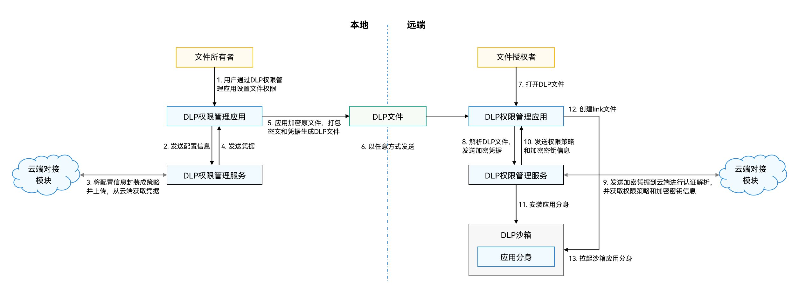

# 安全
## 访问控制概述
- 应用沙箱
- 应用权限
    - system_grant（系统授权）
        - USE_BLUETOOTH, 允许应用查看蓝牙的配置
    - user_grant（用户授权）
        - ACCESS_BLUETOOTH, 允许应用接入蓝牙并使用蓝牙功能
- 安全访问机制
    - 系统Picker, 比如 照片Picker
    - 安全控件
        - **使用粘贴控件**，文本框使用粘贴控件后，用户点击该控件，自动粘贴内容
        - 使用保存控件，第二次保存不在弹出保存位置选择等

# 密码自动填充服务
- 需要经过**身份认证**，比如锁屏密码或验证指纹/人脸      
- 查看已保存的所有账号密码，设置 > 隐私和安全 > 密码保险箱

# 应用加密
- 上架应用时可选择是否加密
- 采用标准AES加密算法，解密后的明文只存在于内存中

# Asset Store Kit（关键资产存储服务）
- **短敏感数据**的**安全存储及管理**功能
- 短敏感数据：密码类、Token类（应用凭据）以及其他关键明文（如银行卡号）等**长度较短的敏感信息**

# Crypto Architecture Kit（加解密算法框架服务）
- 加解密、签名验签、消息认证码、哈希、安全随机数、密钥派生等

约束与限制
- Crypto Architecture Kit不支持多线程并发操作。
- Crypto Architecture Kit当前只支持OpenSSL。
- Crypto Architecture Kit提供了大部分常用的算法

# 数据防泄漏服务（Data Loss Prevention，简称为DLP）
- **系统级**的数据防泄漏解决方案
- 提供文件权限管理、加密存储、授权访问等能力

# Device Certificate Kit（设备证书服务）

# Device Security Kit（设备安全服务）

